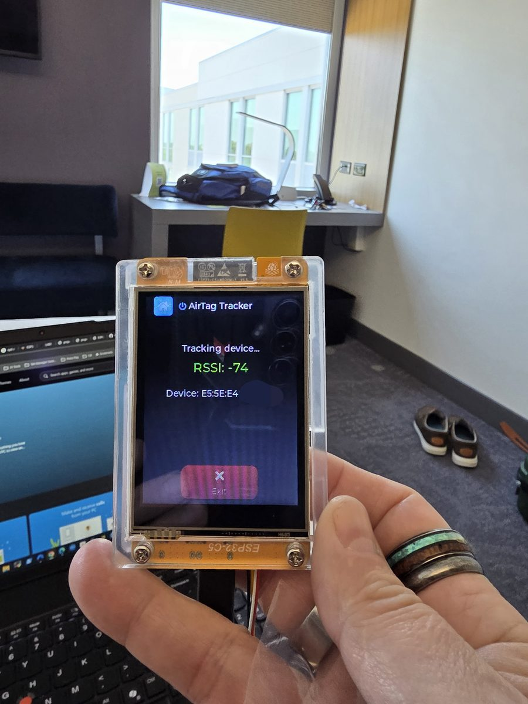
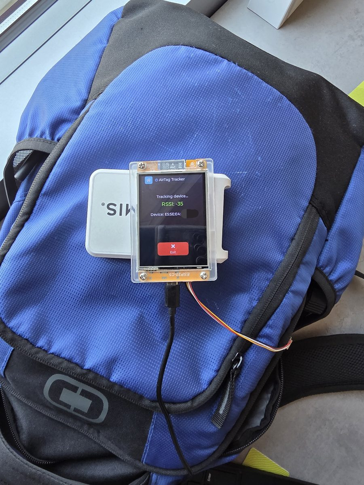

<p align="center">
 
</p>

<h1 align="center">JANOS on NM-CYD-C5</h1>

<p align="center">
  <b>WiFi 6 security toolkit & wardriving device built on NerdMiner ESP32-C5 CYD</b>
</p>

<p align="center">
  
  
  
  
  
  
</p>

---

## Introduction

**Cheap Yellow Monster** is a portable, touchscreen-driven WiFi security toolkit running on the **NM-CYD-C5 ESP32-C5-WIFI6-KIT**. Originally inspired by Pancake, it combines a rich set of offensive and defensive WiFi tools with BLE scanning, GPS wardriving, and a beautiful Material-style dark UI — all packed into a handheld form factor with a 2.8" resistive touch display.

Built entirely on **ESP-IDF 6.0** with **LVGL 8.x** for the UI, the firmware leverages the ESP32-C5's RISC-V core and WiFi 6 capabilities for modern wireless security research and education.

> **Note:** While Pancake provided the original inspiration, this project has diverged substantially in target hardware (ESP32-C5 / NM-CYD-C5), build system (ESP-IDF vs Arduino), UI framework (LVGL 8), feature set, and architecture. It is a standalone project, not a fork.

---

## Table of Contents

- [Features Overview](#features-overview)
- [Screenshots](#screenshots)
- [Hardware](#hardware)
- [Pinout](#pinout)
  - [GPS Wiring — ATGM336H](#gps-wiring--atgm336h)
- [Software Features — Detailed](#software-features--detailed)
  - [WiFi](#1-wifi)
    - [WiFi Scan & Attack](#wifi-scan--attack)
    - [Evil Portal Resources](#evil-portal-resources)
    - [Global WiFi Attacks](#global-wifi-attacks)
    - [WiFi Observer & Karma](#wifi-observer--karma)
    - [Deauth Monitor](#deauth-monitor)
  - [Bluetooth](#2-bluetooth)
  - [Wardriving](#3-wardriving)
  - [Settings](#4-settings)
- [Data & Storage](#data--storage)
- [Touch Calibration](#touch-calibration)
- [Building & Flashing](#building--flashing)
- [Photos](#photos)
- [Disclaimer](#disclaimer)

---

## Features Overview

| Category | Features |
|----------|----------|
| **WiFi Scanning** | Active scan, per-channel analysis, RSSI, client enumeration |
| **WiFi Attacks** | Deauth, Evil Twin, Captive Portal, Blackout, Snifferdog, SAE Overflow |
| **Handshake Capture** | WPA/WPA2 4-way handshake capture (PCAP & HCCAPX) |
| **Karma AP** | Respond to probe requests, rogue access point |
| **Wardriving** | GPS + WiFi logging to SD card (CSV) |
| **BLE** | AirTag scanner, SmartTag detection, BLE Locator, GATT Walker fingerprinting, Bluetooth Lookout |
| **Deauth Monitor** | Passive detection of nearby deauth attacks |
| **Credentials** | Captive portal credential capture, WPA-SEC upload |
| **TX Power Mode** | Selectable Normal / Max Power for WiFi and BLE — persisted across reboots |
| **UI** | Material dark theme, touch gestures, screen dimming, screenshots — all screens portrait 240×320 |
| **Storage** | SD card for handshakes, wardrive logs, GATT Walker JSON, screenshots, file tree browser |

---

## Screenshots


<p align="center">

  <br/>
  <em>Global attacks</em>
</p>

<p align="center">
  

  <br/>
  <em>Handshaker</em>
</p>

<p align="center">


  <br/>
  <em>Kismet-style network observer & Karma attack</em>
</p>


---

## Hardware

| Component | Model | Interface |
|-----------|-------|-----------|
| **MCU** | ESP32-C5-WROOM-1-N168R (RISC-V 240 MHz, 16 MB flash, 8 MB PSRAM) | — |
| **Board** | NM-CYD-C5 (RockBase-iot NerdMiner CYD) | — |
| **Display** | 2.8" ST7789 TFT (240×320 portrait, 16-bit RGB565) | SPI @ 40 MHz |
| **Touch** | XPT2046 Resistive Touch (polling, T_IRQ not connected) | SPI @ 2 MHz |
| **SD Card** | MicroSD **FAT32, max 32 GB** (shared SPI2 bus with display and touch) | SPI @ 20 MHz |
| **GPS** | ATGM336H NMEA module (GGA, RMC sentences) | UART1 @ 9600 baud |
| **LED** | WS2812 NeoPixel (single, GPIO 27) | RMT / GPIO |

Board reference: https://github.com/RockBase-iot/NM-CYD-C5


---

## Pinout

### Wiring Diagram

```
                       ESP32-C5 NM-CYD-C5
                      ┌──────────────────┐
                      │                  │
    Display ──────────┤ GPIO 7   (MOSI)  │──────── Touch / SD Card
    (shared SPI2)     │ GPIO 2   (MISO)  │         (shared SPI2)
                      │ GPIO 6   (SCK)   │⚠️
                      │                  │
    LCD CS ───────────┤ GPIO 23          │
    LCD DC ───────────┤ GPIO 24          │
    LCD BL ───────────┤ GPIO 25          │⚠️ strapping, safe after boot
                      │                  │
    Touch CS ─────────┤ GPIO 1           │
                      │                  │
    SD CS ────────────┤ GPIO 10          │
                      │                  │
    GPS TX (ESP→GPS) ─┤ GPIO 5           │
    GPS RX (GPS→ESP) ─┤ GPIO 4           │
                      │                  │
    NeoPixel ─────────┤ GPIO 27          │
                      │                  │
    Console ──────────┤ USB (JTAG/CDC)   │
                      └──────────────────┘

    ⚠️ = Strapping pins — safe after boot completes
    GPIO 16–22 (excl. 21) = Flash/PSRAM — never use
```

### Complete GPIO Table

| GPIO | Function | Interface | Notes |
|------|----------|-----------|-------|
| 1 | XPT2046 Touch CS | SPI | Active LOW |
| 2 | SPI MISO | SPI2 | Shared: display + touch + SD |
| 4 | GPS RX (GPS→ESP) | UART | LP-UART |
| 5 | GPS TX (ESP→GPS) | UART | LP-UART |
| 6 | SPI SCK | SPI2 | ⚠️ Strapping pin; also ADC1_CH5 — **do not configure as ADC** (breaks SPI clock) |
| 7 | SPI MOSI | SPI2 | ⚠️ Strapping pin, safe after boot |
| 10 | SD Card CS | SPI | Active LOW |
| 16–22 (excl. 21) | Flash/PSRAM | — | **Never use** |
| 23 | ST7789 Display CS | SPI | Active LOW |
| 24 | ST7789 DC (Data/Cmd) | Output | |
| 25 | Backlight | Output | ⚠️ Strapping, HIGH=on |
| 27 | NeoPixel Data | RMT/GPIO | WS2812 LED |

> **GPIO 6 / ADC1_CH5 conflict:** The battery voltage ADC (`BATTERY_ADC_CHANNEL ADC_CHANNEL_5`) maps to GPIO 6, which is also SPI SCK. Calling `adc_oneshot_config_channel` on this pin silently reconfigures it away from SPI, killing SPI clock for display and touch. The battery ADC is **permanently disabled** in firmware for this board revision (`if (false && init_battery_adc()...)`).

> **XPT2046 Z1 pressure:** Touch detection uses Z1 pressure threshold (`> 400` raw counts). Z1 reads near 0 when untouched and rises above threshold when pressed — providing reliable touch detection even though explicit Z electrode PCB traces are not exposed.

### SPI Bus Architecture

```
SPI2_HOST
├── ST7789 Display  (CS = GPIO 23, 40 MHz)
│   ├── MOSI = GPIO 7
│   ├── MISO = GPIO 2
│   ├── SCK  = GPIO 6
│   └── DC = GPIO 24
│
├── XPT2046 Touch   (CS = GPIO 1, 2 MHz)
│
└── SD Card         (CS = GPIO 10, 20 MHz)

Mutual exclusion via sd_spi_mutex
```

### GPS Wiring — ATGM336H

The ATGM336H is a compact GPS/GNSS module that outputs standard NMEA 0183 sentences (GGA, RMC) at 9600 baud. It is wired directly to the NM-CYD-C5 LP-UART pins — no level shifter required as the module operates at 3.3 V.

```
ATGM336H Module          NM-CYD-C5 (ESP32-C5)
┌────────────┐           ┌──────────────────┐
│        VCC ├───────────┤ 3.3 V            │
│        GND ├───────────┤ GND              │
│         TX ├───────────┤ IO4  (UART1 RX)  │
│         RX ├───────────┤ IO5  (UART1 TX)  │
│        PPS │  (unused) │                  │
└────────────┘           └──────────────────┘
```

| Signal | ATGM336H pin | ESP32-C5 pin | Notes |
|--------|-------------|-------------|-------|
| Power | VCC | 3.3 V | Do **not** connect to 5 V — module is 3.3 V only |
| Ground | GND | GND | Common ground required |
| Data to ESP | TX | IO4 (UART1 RX) | Module transmits NMEA sentences |
| Data from ESP | RX | IO5 (UART1 TX) | Optional — only needed to send config commands |
| Timing pulse | PPS | — | Not connected; not used by firmware |

**Settings:** UART1 · 9600 baud · 8N1 · no flow control

The firmware parses GGA sentences for latitude, longitude, altitude, and satellite count, and RMC sentences for fix validity. Cold start to first fix typically takes 30–60 seconds with a clear sky view.

---

## Software Features — Detailed

### 1. WiFi

The **WiFi** tile opens a sub-menu grouping all WiFi functions:

```
Main Menu
└── WiFi
    ├── Scan & Attack
    ├── WiFi Attacks
    ├── Deauth Mon.
    └── WiFi Observer
```

#### WiFi Scan & Attack

**Active WiFi scanning** with per-network details, followed by targeted attacks on selected networks.

| Feature | Description |
|---------|-------------|
| **WiFi Scan** | Scans all channels, shows SSID, BSSID, RSSI, channel, encryption |
| **Deauth Attack** | Sends deauthentication frames to disconnect clients from selected AP |
| **Evil Twin** | Creates a rogue AP cloning the target SSID to lure clients |
| **Captive Portal** | HTTP server presenting a custom HTML login page to capture credentials |
| **Handshake Capture** | Captures WPA/WPA2 4-way handshakes and saves as PCAP/HCCAPX |
| **ARP Poisoning** | LwIP-based ARP spoofing for MitM scenarios |

#### Evil Portal Resources

The Captive Portal feature serves a single HTML file from `/sdcard/lab/portal/` as the login page. Any valid HTML file dropped there will be served — no recompilation needed. The community has built extensive collections of pre-made portals styled to look like ISP login pages, hotel WiFi gates, popular service sign-ins, and more.

| Repository | Description |
|------------|-------------|
| [D3h420/Evil-Portals-Collection](https://github.com/D3h420/Evil-Portals-Collection) | Large multi-target collection of portal HTML files — ISPs, hotels, and brands |
| [saintcrossbow/Evil-Cardputer-Portals](https://github.com/saintcrossbow/Evil-Cardputer-Portals) | Portal pages adapted for M5Stack Cardputer; most transfer directly |
| [DoobTheGoober/EvilPortalGenerator](https://github.com/DoobTheGoober/EvilPortalGenerator) | Generator tool for quickly creating custom portal pages from templates |

Drop the desired `index.html` (or rename your file to `index.html`) into `/sdcard/lab/portal/` and launch **Captive Portal** from the Scan & Attack menu. Credentials entered on the page are logged to `/sdcard/lab/portal/credentials.txt`.

#### Global WiFi Attacks

Attacks that operate on **all nearby networks** simultaneously.

| Feature | Description |
|---------|-------------|
| **Blackout** | Mass deauthentication of all detected networks in range |
| **Snifferdog** | Channel-hopping sniffer with automatic client deauthentication; exits cleanly and returns radio to normal WiFi scan mode |
| **SAE Overflow** | WPA3 SAE authentication flood attack |

#### WiFi Observer & Karma

Passive network intelligence and rogue AP capabilities.

| Feature | Description |
|---------|-------------|
| **WiFi Observer** | Passive 802.11 sniffing in promiscuous mode — shows APs, associated clients, and probe requests |
| **Karma AP** | Automatically responds to client probe requests, creating matching rogue APs |

#### Deauth Monitor

**Passive detection** of deauthentication attacks happening in the area. Alerts when deauth frames are detected on nearby channels — useful for detecting hostile activity.

### 2. Bluetooth

BLE scanning and fingerprinting features leveraging the ESP32-C5's BLE 5.0 radio.

```
Bluetooth
├── BT Scan & Select    ← start here
│   └── (select device) → Actions
│       ├── BT Locator  (RSSI tracking)
│       ├── GATT Walker (full GATT fingerprint + JSON output)
│       └── Add to BT Lookout
├── AirTag Scan
├── BT Locator
└── Bluetooth Lookout   ← continuous watchlist monitor
    ├── Edit Watchlist
    └── OUI Groups
```

| Feature | Description |
|---------|-------------|
| **BT Scan & Select** | Active BLE scan — discovers all nearby devices; shows name or vendor (from OUI lookup), RSSI, partial MAC; tap to select a target |
| **BT Locator** | RSSI-based proximity tracking of a selected BLE device; updates every 10 s |
| **GATT Walker** | Full BLE GATT inspection — walks all services, characteristics, and descriptors; reads attribute values; computes FNV-32 device fingerprint; saves structured JSON to SD card with optional GPS geotag |
| **AirTag Scanner** | Passive BLE scan — detects Apple AirTags and Samsung SmartTags by manufacturer ID |
| **Tag Locator** | Per-tag RSSI tracking launched from the AirTag Scan found-tags list |
| **Bluetooth Lookout** | Continuous BLE monitor that alerts when a watchlisted device (by full MAC or OUI prefix) is detected nearby |

> **Note:** WiFi and BLE share the same radio. The firmware automatically switches between `RADIO_MODE_WIFI` and `RADIO_MODE_BLE` as needed.

#### BT Scan & Select — How It Works

**Step 1 — Scan:** Open **BT Scan & Select** from the Bluetooth menu. A 10-second active BLE scan runs, collecting all advertising devices. Each row shows device name (or vendor from OUI lookup, or `[Unknown]`), RSSI, and the last 3 octets of the MAC address. The list updates live every 500 ms during the scan.

**Step 2 — Select:** Tap any row to select a target device. The row highlights in cyan and the status bar shows the selection. Tap again to deselect. Only one device can be selected at a time.

**Step 3 — Actions:** Once a device is selected, tap **Actions →** to open the action tile screen. Available actions: **BT Locator** (RSSI proximity tracking), **GATT Walker** (full GATT inspection and JSON output), and **Add to BT Lookout** (add the device MAC to the continuous watchlist). The target name or MAC is shown in the screen title.

#### AirTag / SmartTag Locator — How It Works

The AirTag Scanner and Tag Locator work together to let you find a hidden tracking device using only the NM-CYD-C5 — no phone required.

**Step 1 — Scan**

Open **AirTag Scan** from the Bluetooth tile. The device switches the radio to BLE and begins a passive scan. Detected Apple AirTags and Samsung SmartTags are counted on screen, separated from general BLE traffic:

```
Air Tags:   2
Smart Tags: 1

Other BT Devices: 14
Total BT devices: 17
```

Once at least one tag is found the **View Found Tags** button appears.

**Step 2 — View Found Tags**

Tap **View Found Tags** to open a scrollable list of every detected AirTag and SmartTag. Each entry shows:

- Type badge (orange **AirTag** or cyan **SmartTag**)
- MAC address
- Device name (if advertised)
- Last seen RSSI in dBm
- A blue **Track** button

**Step 3 — Track**

Tap **Track** on any device. The firmware locks onto that device's MAC address and starts the BT Locator tracking task, which rescans for that specific MAC every 10 seconds and updates the live RSSI reading on screen.

Use the RSSI value to home in on the tag — a higher (less negative) number means you are closer:

| RSSI | Approximate distance |
|------|----------------------|
| −40 to −55 dBm | Very close (within ~1 m) |
| −55 to −70 dBm | Nearby (~1–5 m) |
| −70 to −85 dBm | In the same room (~5–15 m) |
| Below −85 dBm | Far away or obstructed |

<p align="center">
  
  <br/>
  <em>AirTag Far Away</em>
</p>

<p align="center">
  
  <br/>
  <em>AirTag Found</em>
</p>

Tap **Exit** at any time to stop tracking and return to the main menu. The radio switches back to WiFi mode automatically.

#### GATT Walker — How It Works

**GATT Walker** connects to a selected BLE device and performs a full GATT inspection — enumerating every service, characteristic, and descriptor, reading all readable attribute values, and saving the result as a structured JSON file on the SD card.

**Workflow:**

1. Open **BT Scan & Select**, let the scan run, tap a device to select it.
2. Tap **Actions →**, then **GATT Walker**.
3. The active BLE scan stops automatically and a GATT connection is initiated to the target.
4. The screen shows live progress through the walk stages:

```
Connecting...
Connected, discovering services...
Chr discovery: svc 2/5
Discovering descriptors...
Reading characteristics...
Saving results...
Walk complete
```

5. When done, the screen shows the service count, characteristic count, FNV-32 fingerprint, and the file path. Tap **Back** to return to the action menu.

**Output file:** `/sdcard/gattwalker/YYYYMMDD_HHMMSS_AABBCCDDEEFF_gattwalk.json`

```json
{
  "version": 1,
  "timestamp": "20260429_142233",
  "mac": "AA:BB:CC:DD:EE:FF",
  "addr_type": 0,
  "name": "My BLE Device",
  "rssi": -67,
  "gps": { "valid": true, "lat": 37.1234567, "lon": -122.4567890 },
  "fingerprint": "0xA3F1C2B0",
  "services": [
    {
      "uuid": "0x1800",
      "start_handle": 1,
      "end_handle": 8,
      "characteristics": [
        {
          "uuid": "0x2A00",
          "def_handle": 2,
          "val_handle": 3,
          "properties": 2,
          "read_data": "4D7920446576696365",
          "descriptors": []
        }
      ]
    }
  ]
}
```

**Fingerprint:** An FNV-32 hash computed over all service UUIDs, characteristic UUIDs, and property flags in walk order. Identical device models typically produce the same fingerprint, making it useful for passive device-type identification across multiple captures.

**GPS geotagging:** If a GPS fix is active when GATT Walker starts, the coordinates are embedded in the JSON. This enables later mapping of device sightings.

**Limits:** Up to 20 services, 10 characteristics per service, 4 descriptors per characteristic, 48 bytes read per attribute. PSRAM-allocated (~50 KB result struct + 64 KB JSON buffer).

> **Note:** GATT Walker connects to the target — it is an active, deliberate inspection, not passive. The target device will see an incoming connection. Cancel at any time with the **Cancel Walk** button; the connection is cleanly terminated.

#### Bluetooth Lookout — How It Works

**Bluetooth Lookout** runs a continuous background BLE scan and alerts you — visually and via NeoPixel LED — any time a watchlisted device is seen nearby. Useful for detecting known surveillance hardware, trackers, or specific devices by MAC address or manufacturer OUI prefix.

**Watchlist:** Devices are stored in `/sdcard/lab/bluetooth/lookout.csv`. The file is auto-created on first use. Add devices two ways:

- **BT Scan & Select → Add to Lookout** — scans for BLE devices, select one, choose "Add to Lookout". The exact MAC is added.
- **OUI Groups** (see below) — adds all devices from a known manufacturer OUI prefix.

**Matching modes:**
- **Full MAC** — triggers only when that exact 6-byte address is seen. Best for tracking a specific known device.
- **OUI prefix** — triggers when *any* device from that manufacturer's OUI block (`AA:BB:CC:*:*:*`) is seen. Best for detecting a category of hardware (e.g., any Axon body camera in range).

**Alert:** When a match is found the NeoPixel flashes red (3 × 250 ms on/off) and a popup appears on screen showing the device name, MAC address, vendor (if OUI database is loaded), and RSSI. A 30-second per-device cooldown prevents repeated alerts for the same device.

**Controls on the Lookout screen:**

| Button | Action |
|--------|--------|
| Start / Stop | Toggle the continuous BLE scan loop |
| Blackout | Dim the screen to black while monitoring continues in the background |
| Edit List | Open the watchlist editor — mark entries for deletion, then Save |
| OUI Groups | Add predefined law-enforcement / tracking hardware groups to the watchlist |

#### OUI Groups

**OUI Groups** (accessible from the Bluetooth Lookout screen) lets you add entire manufacturer OUI blocks to the watchlist in one tap. The firmware will then alert whenever *any* BLE device from that manufacturer is detected.

Pre-loaded groups:

| Group | OUI Prefix(es) | Category |
|-------|---------------|----------|
| **Axon Body Cam** | `00:25:DF` | Law enforcement body-worn cameras |
| **Flock Safety ALPR** | `70:C9:4E`, `3C:91:80`, `D8:F3:BC` | Automated license plate readers |
| **Motorola Solutions** | `4C:CC:34` | Two-way radio / body cameras |
| **Samsung SmartTag** | `64:1B:2F` | Bluetooth trackers |

Tap **+ Add to Watchlist** on any group card. Each OUI is written to `lookout.csv` as an OUI-only entry (visible in the editor as `OUI: AA:BB:CC:*`). Entries added this way are preserved across reboots and editable via **Edit List**.

### 3. Wardriving

GPS-enabled WiFi logging for mapping wireless networks. Requires an **ATGM336H** (or compatible NMEA module) wired to IO4/IO5 — see [GPS Wiring](#gps-wiring--atgm336h).

- Combines GPS coordinates (NMEA GGA/RMC) with WiFi scan results
- Uses D-UCB channel hopping for thorough band coverage
- Logs SSID, BSSID, channel, RSSI, auth mode, and GPS coordinates to CSV on the SD card
- Compatible with standard wardriving visualization tools (Wigle, etc.)

### 4. Settings

| Setting | Description |
|---------|-------------|
| **Screen Timeout** | Inactivity timer before display dimming |
| **Brightness** | Software brightness overlay (10–100%) |
| **Scan Duration** | Configurable WiFi scan time |
| **SD Card** | Validate/provision (creates `/sdcard/lab/` structure, shows completion status); browse file tree; check free space |
| **GPS Info** | Live GPS fix status, latitude, longitude, altitude, satellite count, and UART config reference (IO4/IO5, 9600 baud, ATGM336H) |
| **Power Mode** | TX Power Mode selector — Normal or Max Power (see below) |

All settings are persisted via **NVS** (Non-Volatile Storage) across reboots.

#### TX Power Mode

Accessible via **Settings → Power Mode**. Defaults to **Normal** on first boot.

| Mode | WiFi | BLE |
|------|------|-----|
| **Normal** | Default IDF TX power, modem-sleep enabled (`WIFI_PS_MIN_MODEM`) | Default controller TX power |
| **Max Power** | TX cap set to 82 (~20.5 dBm nominal), modem-sleep disabled (`WIFI_PS_NONE`) | All BLE power types set to P9 (+9 dBm) |

Switching modes takes effect immediately on the active radio and is re-applied automatically every time WiFi or BLE is started — including on attack start/stop and radio mode switches.

> **Note:** Actual radiated power (EIRP) is still bounded by the NM-CYD-C5's PCB antenna, PHY calibration data, and the country/regulatory settings loaded at boot. Max Power increases effective range but does not bypass regulatory limits enforced by the PHY layer.

### UI & System Features

| Feature | Description |
|---------|-------------|
| **LVGL Material Dark Theme** | Modern, touch-friendly dark UI |
| **Portrait 240×320 Layout** | All screens designed and reflowed for the NM-CYD-C5's 240×320 portrait display |
| **5-Tile Main Menu** | WiFi, Bluetooth, Wardrive, Settings, Go Dark — WiFi expands to sub-menu |
| **Screenshot Capture** | Tap the **title bar** on any screen to save a BMP to `/sdcard/screenshots/` — works on every screen including all menus, feature pages, and live data views |
| **WPA-SEC Upload** | Upload captured handshakes to wpa-sec.stanev.org via HTTPS |
| **NeoPixel Status LED** | Mode-based color indicator via WS2812 LED (GPIO 27) |

### NeoPixel LED Color Reference

| Color | Mode |
|-------|------|
| White | Idle / system ready |
| Blue | WiFi scanning |
| Green | Passive sniffer / SnifferDog |
| Cyan | Wardrive |
| Purple | BLE scan / AirTag / BT locator |
| Yellow | WPA handshake capture |
| Amber | Deauth monitor / MITM ARP |
| Orange | Karma attack / captive portal |
| Red | Deauth / blackout / SAE overflow |

---

## Data & Storage

> **SD card requirement:** MicroSD formatted as **FAT32, 32 GB or smaller**. exFAT and NTFS are not supported. SDXC cards (>32 GB) require manual FAT32 formatting before use.

All data is stored on the SD card:

```
/sdcard/
├── lab/
│   ├── white.txt         # MAC/SSID whitelist (one per line)
│   ├── ouilist.bin       # OUI vendor table — adds manufacturer names to BLE scan results
│   ├── handshakes/       # Captured WPA handshakes
│   │   ├── *.pcap        # Wireshark-compatible captures
│   │   └── *.hccapx      # Hashcat-compatible format (hashcat)
│   ├── bluetooth/
│   │   └── lookout.csv   # Bluetooth Lookout watchlist
│   └── portal/           # Captive portal files
│       ├── index.html    # Custom portal page — drop any HTML file here
│       └── credentials.txt  # Captured login credentials (appended on each submit)
├── wardrive/             # GPS + WiFi logs (CSV)
├── gattwalker/           # GATT Walker JSON fingerprints
│   └── YYYYMMDD_HHMMSS_AABBCCDDEEFF_gattwalk.json
├── screenshots/          # UI screenshots (BMP)
└── calibrate.txt         # ← Create this file to trigger touch re-calibration on next boot
```

### Screenshot Capture

Tap the **title bar on any screen** to capture a screenshot. The image is saved as an uncompressed 24-bit BMP to `/sdcard/screenshots/screen_N.bmp` with an auto-incrementing index. The write runs in a background task so the UI stays responsive, and the title bar is briefly disabled while the save is in progress to prevent double-captures. Requires a mounted SD card — a warning is logged if the card is unavailable.

Screenshots are captured at full 240×320 resolution and can be opened directly in any image viewer or graphics application.

### OUI Vendor Lookup

Adds manufacturer names to BLE scan results by matching each device's MAC OUI prefix against a compact vendor table loaded from SD card. Results appear as vendor names in the **BT Scan & Select** list (replacing `[Unknown]` for unidentified devices) and as an additional line in **Bluetooth Lookout** detection popups.

Requires a curated binary table at `/sdcard/lab/ouilist.bin`. Generate or refresh it whenever the IEEE OUI list changes:

1. Download the latest OUI CSV from IEEE Standards:
   ```
   https://standards-oui.ieee.org/oui/oui.csv
   ```
   Place it in the repository root (or any convenient location).

2. Run the converter:
   ```bash
   python tools/oui_convert.py oui.csv ouilist.bin
   ```

3. Copy `ouilist.bin` onto the SD card under `/lab/`:
   ```
   /sdcard/lab/ouilist.bin
   ```

The firmware loads the binary into PSRAM on first entry to any BT feature and searches it with binary search — no large stack allocations. If the file is missing, vendor lookup is skipped transparently and scan results show `[Unknown]` as before.

---

The **SD Card → File Tree** utility (Settings menu) lets you browse the SD card's directory tree directly on the device — useful for confirming handshakes and wardrive logs were saved without needing to remove the card.

**SD Card Provision** (Settings → SD Card → Provision) creates the full `/sdcard/lab/` folder structure in one tap. When complete, the screen shows a "Done — N created, M OK" summary in a status bar above the Back button.

---

## Touch Calibration

The XPT2046 resistive touch panel requires one-time calibration to map raw ADC values to screen coordinates. Calibration data is saved in NVS and survives reboots.

### First Boot

Calibration runs automatically the first time the firmware boots (when no NVS calibration is found). The sequence appears after the splash screen:

1. **"Do NOT touch screen"** — holds for 2 seconds while measuring the panel's resting (null) position.
2. **"Touch the [+] Top-Left (1/3)"** — a white crosshair appears at the top-left corner. Press it firmly and hold until the screen advances.
3. **"Touch the [+] Top-Right (2/3)"** — press the top-right crosshair.
4. **"Touch the [+] Bottom-Left (3/3)"** — press the bottom-left crosshair.
5. **"Calibration done!"** — calculated values are saved to NVS namespace `touch_cal` and applied immediately.

### Re-Calibrating

To re-run calibration after first boot, create a **trigger file** on the SD card:

```
/sdcard/calibrate.txt
```

The file content does not matter. On the next boot, the firmware detects it, deletes it, and runs the calibration UI before showing the home screen.

### What Is Stored (NVS namespace `touch_cal`)

| Key | Type | Description |
|-----|------|-------------|
| `x_min` / `x_max` | i32 | Raw ADC X range mapped to screen edges |
| `y_min` / `y_max` | i32 | Raw ADC Y range mapped to screen edges |
| `null_x` / `null_y` | i32 | Resting panel position (false-touch dead zone center) |
| `invert_x` / `invert_y` | u8 | Axis inversion flags (NM-CYD-C5: both typically `1`) |
| `swap_xy` | u8 | Axis swap (typically `0` for portrait) |
| `magic` | u16 | `0xCA11` — marks calibration as valid |

### Default Fallback

If NVS has no calibration (i.e., `magic` ≠ `0xCA11`), the firmware applies hardware-observed defaults for the NM-CYD-C5: **both axes inverted** (`invert_x = true`, `invert_y = true`). These are good enough for initial boot but may be off by ~20 pixels. Run calibration for accurate touch.

---

## Building & Flashing

### Prerequisites

- **ESP-IDF release/v6.0** branch tip (NOT the `v6.0` tag — it's missing critical post-release fixes)
- **NM-CYD-C5** board (ESP32-C5-WROOM-1-N168R)

### Build

```bash
cd ESP32C5
idf.py set-target esp32c5
idf.py build
```

After each build the compiled binaries are automatically copied to `ESP32C5/binaries-esp32c5/`.

### Flash — Web Browser (No Install Required)

Use **[ESPConnect](https://thelastoutpostworkshop.github.io/ESPConnect/)** to flash directly from Chrome or Edge via WebSerial. Flash each file at the address shown below.

| File | Address |
|------|---------|
| `bootloader.bin` | `0x2000` |
| `partition-table.bin` | `0x8000` |
| `CYM-NM28C5.bin` | `0x10000` |

> **[ESPTerminator](https://espterminator.com/)** is a newer web flash/terminal tool but does not yet identify the NM-CYD-C5 correctly and fails to flash the board reliably. Check back for future support.

### Flash — Command Line

```bash
idf.py -p /dev/ttyACM0 flash monitor
```

Or with esptool directly:

```bash
esptool.py --chip esp32c5 --port /dev/ttyACM0 --baud 460800 \
  --before default-reset --after hard-reset \
  write_flash --flash-mode dio --flash-freq 80m --flash-size 16MB \
  0x2000 bootloader.bin 0x8000 partition-table.bin 0x10000 CYM-NM28C5.bin
```

---

## Photos

<!-- Add your hardware photos here -->

<p align="center">


  <br/>
  <em>Device — Front View</em>
</p>

<p align="center">


  <br/>
  <em>Device — Back / Wiring</em>
</p>

<p align="center">


  <br/>
  <em>Home-made waveshare build</em>
</p>

---

## Project Structure

```
CYM-NM28C5/
├── ESP32C5/
│   ├── main/
│   │   ├── main.c                # Core application — all UI screens, boot sequence,
│   │   │                         #   WiFi/BLE logic, touch calibration, GPS, wardriving
│   │   ├── attack_handshake.c/h  # WPA handshake capture (PCAP & HCCAPX)
│   │   ├── bt_lookout.c/h        # Bluetooth Lookout — CSV watchlist, LED alerts, OUI matching
│   │   ├── oui_lookup.c/h        # OUI vendor lookup — PSRAM binary search over ouilist.bin
│   │   ├── gatt_walker.c/h       # GATT Walker — NimBLE GATT client, JSON output, FNV-32 fingerprint
│   │   ├── xpt2046.c/h           # XPT2046 SPI touch driver (polling, null-zone, calibration)
│   │   ├── lvgl_memory.c/h       # PSRAM allocator for LVGL
│   │   └── dexter_img.c/h        # Dexter mascot image data (splash screen, RGB565)
│   ├── components/
│   │   ├── wifi_cli/             # CLI, WiFi init, LED control; wifi_common.c/h (shared constants)
│   │   ├── wifi_scanner/         # Active WiFi scan engine, target BSSID tracking
│   │   ├── wifi_sniffer/         # Promiscuous sniffer, SnifferDog, probe request logging
│   │   ├── wifi_attacks/         # Deauth, Evil Twin, Captive Portal, Karma, SAE Overflow
│   │   ├── wifi_wardrive/        # GPS + WiFi wardriving, SD card CSV logging
│   │   ├── sniffer/              # Raw 802.11 frame capture
│   │   ├── frame_analyzer/       # EAPOL / beacon / probe frame parsing
│   │   ├── pcap_serializer/      # PCAP file writer (Wireshark-compatible)
│   │   ├── hccapx_serializer/    # HCCAPX file writer (hashcat)
│   │   ├── led_strip/            # Local WS2812 RMT driver (replaces legacy managed component)
│   │   └── espressif__esp_lcd_ili9341/  # ST7789 LCD panel driver (Espressif component, local copy)
│   ├── binaries-esp32c5/         # Pre-built flashable binaries (bootloader, partition-table, app)
│   ├── docs/
│   │   ├── index.html            # Web flasher UI
│   │   └── manifest.json         # OTA / web flash manifest
│   ├── partitions.csv            # nvs(24K) phy_init(4K) factory(7MB) storage(960K)
│   ├── sdkconfig.defaults        # Default Kconfig values (PSRAM, dual-band WiFi, LVGL)
│   ├── post_build.cmake          # Copies build artifacts → binaries-esp32c5/ after each build
│   ├── sdkconfig
│   └── CMakeLists.txt
├── docs/
│   └── screenshots/              # Screenshot assets used in this README
├── NM-CYD-C5-pinmap.md          # Full GPIO pin map with migration notes
├── CLAUDE.md                     # Claude Code project instructions
└── README.md
```

---

## BMorcelli Launcher Compatibility

This firmware is **not currently compatible** with [bmorcelli/Launcher](https://github.com/bmorcelli/Launcher).

| Issue | Detail |
|-------|--------|
| **ESP32-C5 not supported** | Tracked in [Issue #300](https://github.com/bmorcelli/Launcher/issues/300) — pending merge as of April 2026 |
| **Partition layout mismatch** | Launcher requires OTA-style partition slots; this build uses a single 7 MB `factory` partition at `0x10000` |
| **Custom bootloader conflict** | Launcher's bootloader switches apps via reset-reason detection; this firmware has no handoff logic |
| **Framework mismatch** | Launcher is Arduino; this firmware is ESP-IDF 6.0 — display/touch init sequences would conflict |

Flash this firmware standalone (see [Building & Flashing](#building--flashing)). Launcher integration can be revisited once Issue #300 is merged and an official NM-CYD-C5 board target exists upstream.

---

## Disclaimer

This project is intended for **educational and authorized security research purposes only**. Unauthorized access to computer networks is illegal. Always obtain proper authorization before testing on any network you do not own. The author assumes no liability for misuse of this software.

# **Don't Be A Skid!**

---

<p align="center">
  <b>Made with ☕ and ESP-IDF</b>
</p>

I love your Face!
