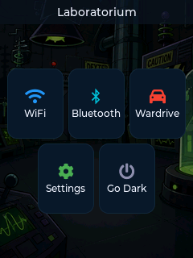
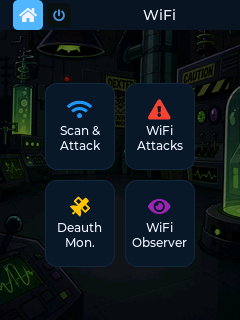
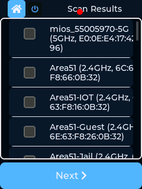
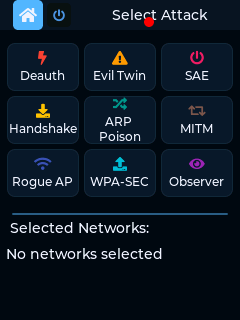
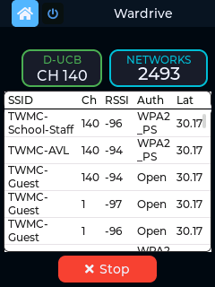
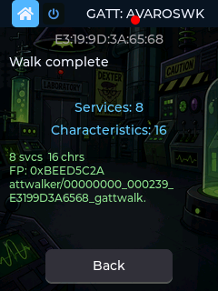

<p align="center">
 
</p>

<h1 align="center">Cheap Yellow Monster</h1>

<p align="center">
  <b>v1.3.4</b>
</p>

<p align="center">
  WiFi 6 &amp; BLE security toolkit with SigInt &amp; Wardriving built on NerdMiner ESP32-C5 CYD
</p>

<p align="center">
  
  
  
  
  
  
</p>

<p align="center">
  
</p>

---

## Introduction

**Cheap Yellow Monster** is a portable, touchscreen-driven WiFi security toolkit running on the **NM-CYD-C5 ESP32-C5-WIFI6-KIT**. Originally inspired by Pancake, it combines a rich set of offensive and defensive WiFi tools with BLE scanning, GPS wardriving, and a beautiful Material-style dark UI — all packed into a handheld form factor with a 2.8" resistive touch display.

Built entirely on **ESP-IDF 6.0** with **LVGL 8.x** for the UI, the firmware leverages the ESP32-C5's RISC-V core and WiFi 6 capabilities for modern wireless security research and education.

> **Note:** While Pancake provided the original inspiration, this project has diverged substantially in target hardware (ESP32-C5 / NM-CYD-C5), build system (ESP-IDF vs Arduino), UI framework (LVGL 8), feature set, and architecture. It is a standalone project, not a fork.

The NM-CYD-C5 can be purchased at [nmminer.com](https://www.nmminer.com/product/nm-cyd-c5/). Additional purchase sources and full hardware documentation are available on the [official board repository](https://github.com/RockBase-iot/NM-CYD-C5).

---

## Table of Contents

- [Features Overview](#features-overview)
- [Screenshots](#screenshots)
- [Hardware](#hardware)
- [Pinout](#pinout)
  - [GPS Wiring — ATGM336H](#gps-wiring--atgm336h)
- [Software Features — Detailed](#software-features--detailed)
  - [WiFi](#1-wifi)
    - [WiFi Scan & Attack](#wifi-scan--attack)
    - [Evil Portal Resources](#evil-portal-resources)
    - [Global WiFi Attacks](#global-wifi-attacks)
    - [WiFi Observer & Karma](#wifi-observer--karma)
    - [Deauth Monitor](#deauth-monitor)
  - [Bluetooth](#2-bluetooth)
    - [BLE PCAP — How It Works](#ble-pcap--how-it-works)
    - [BT Scan & Select — How It Works](#bt-scan--select--how-it-works)
    - [AirTag / SmartTag Locator — How It Works](#airtag--smarttag-locator--how-it-works)
    - [GATT Walker — How It Works](#gatt-walker--how-it-works)
    - [BT Observer — How It Works](#bt-observer--how-it-works)
    - [Bluetooth Lookout — How It Works](#bluetooth-lookout--how-it-works)
  - [Wardriving](#3-wardriving)
    - [Starting a Wardrive](#starting-a-wardrive)
    - [Mark Button — GPS Waypoints](#mark-button--gps-waypoints)
    - [Options Screen](#options-screen)
    - [BLE Time-Sliced Wardriving](#ble-time-sliced-wardriving)
    - [Manage Data Screen](#manage-data-screen)
    - [Wardrive File Format](#wardrive-file-format)
    - [Wardriving Workflow — Field Use](#wardriving-workflow--field-use)
  - [Settings](#4-settings)
    - [TX Power Mode](#tx-power-mode)
    - [GATT Connect Timeout](#gatt-connect-timeout)
    - [Data Transfer](#data-transfer)
- [Data & Storage](#data--storage)
- [Touch Calibration](#touch-calibration)
- [Building & Flashing](#building--flashing)
- [Photos](#photos)
- [On Signal Jamming](#on-signal-jamming)
- [Disclaimer](#disclaimer)

---

## Features Overview

| Category | Features |
|----------|----------|
| **WiFi Scanning** | Active scan, per-channel analysis, RSSI, client enumeration |
| **WiFi Attacks** | Deauth, Evil Twin, Captive Portal, Blackout, Snifferdog, SAE Overflow |
| **Handshake Capture** | WPA/WPA2 4-way handshake capture (PCAP & HCCAPX) |
| **Karma AP** | Respond to probe requests, rogue access point |
| **Chanalizer** | Wide 520 px WiFi channel map — auto-scrolling left/right with touch-drag pause; SSID color grouping, group legend, channel annotations; portrait 240 px viewport over 2.4 GHz + 5 GHz |
| **WiFi Band Scope** | Promiscuous RSSI per-channel waterfall (2.4 GHz 13-ch or 5 GHz 25-ch); band toggle updates axis label and resets peaks; 60 ms dwell / 0.8 s full 2.4 sweep |
| **BLE Band Scope** | Passive BLE scan RSSI histogram + waterfall — packet RSSI distribution across −100 to −30 dBm |
| **Drone Detector** | Passive BLE scan for DJI/Remote ID drone advertisements |
| **Wardriving** | GPS + WiFi logging, dual-band filter (2.4 GHz / 5 GHz / Both), optional BLE time-sliced scanning, WiGLE CSV 1.6, upload log tracking, raw PCAP toggle, GPS mark waypoints (GPX output), WiGLE and WDG Wars upload; GPS last-known position hold with 150 m stale accuracy when signal is lost |
| **GPS** | NMEA RMC auto-syncs system clock (FAT timestamps); last-known position persisted to NVS (5-minute throttle); manual fallback editor in Settings → GPS Info; all data-collection features (wardrive, GATT Walker, marks) use best available GPS transparently |
| **BLE** | AirTag scanner, SmartTag detection, BLE Locator, GATT Walker fingerprinting, BT Observer multi-walk, Bluetooth Lookout, BLE Spam (8 modes incl. Sour Apple), Device Spoof (general + directed), BLE Disconnect (directed), BLE PCAP (Kismet PCAPNG raw capture) |
| **Deauth Monitor** | Passive detection of nearby deauth attacks |
| **Credentials** | Captive portal credential capture, WPA-SEC upload |
| **TX Power Mode** | Selectable Normal / Max Power for WiFi and BLE — persisted across reboots |
| **Data Transfer** | Self-hosted AP file server (TheLab) and WiFi client file server — browse & download SD card contents from any browser; IP shown on screen |
| **UI** | Material dark theme, touch gestures, screen dimming, screenshots — all screens portrait 240×320 |
| **Storage** | SD card for handshakes, wardrive logs, GATT Walker JSON, screenshots, file tree browser |

---

## Screenshots

<p align="center">
  
  &nbsp;
  
  &nbsp;
  
</p>
<p align="center">
  
  &nbsp;
  
</p>
<p align="center">
  <em>Main Menu &nbsp;·&nbsp; WiFi Menu &nbsp;·&nbsp; Scan & Attack &nbsp;·&nbsp; Select Target &nbsp;·&nbsp; Wardrive</em>
</p>

---

## Hardware

| Component | Model | Interface |
|-----------|-------|-----------|
| **MCU** | ESP32-C5-WROOM-1-N168R (RISC-V 240 MHz, 16 MB flash, 8 MB PSRAM) | — |
| **Board** | NM-CYD-C5 (RockBase-iot NerdMiner CYD) | — |
| **Display** | 2.8" ST7789 TFT (240×320 portrait, 16-bit RGB565) | SPI @ 40 MHz |
| **Touch** | XPT2046 Resistive Touch (polling, T_IRQ not connected) | SPI @ 2 MHz |
| **SD Card** | MicroSD **FAT32, max 32 GB** (shared SPI2 bus with display and touch) | SPI @ 20 MHz |
| **GPS** | [ATGM336H GPS+BDS Dual-Mode Module](https://www.amazon.com/dp/B09LQDG1HY) (Teyleten Robot, ASIN B09LQDG1HY; search "ATGM336H UART" if unavailable) — outputs NMEA 0183 GGA + RMC at 9600 baud, 3.3 V, onboard ceramic patch antenna | UART1 @ 9600 baud |
| **LED** | WS2812 NeoPixel (single, GPIO 27) | RMT / GPIO |

Board reference: https://github.com/RockBase-iot/NM-CYD-C5


---

## Pinout

### Wiring Diagram

```
                       ESP32-C5 NM-CYD-C5
                      ┌──────────────────┐
                      │                  │
    Display ──────────┤ GPIO 7   (MOSI)  │──────── Touch / SD Card
    (shared SPI2)     │ GPIO 2   (MISO)  │         (shared SPI2)
                      │ GPIO 6   (SCK)   │⚠️
                      │                  │
    LCD CS ───────────┤ GPIO 23          │
    LCD DC ───────────┤ GPIO 24          │
    LCD BL ───────────┤ GPIO 25          │⚠️ strapping, safe after boot
                      │                  │
    Touch CS ─────────┤ GPIO 1           │
                      │                  │
    SD CS ────────────┤ GPIO 10          │
                      │                  │
    GPS TX (ESP→GPS) ─┤ GPIO 5           │
    GPS RX (GPS→ESP) ─┤ GPIO 4           │
                      │                  │
    NeoPixel ─────────┤ GPIO 27          │
                      │                  │
    Console ──────────┤ USB (JTAG/CDC)   │
                      └──────────────────┘

    ⚠️ = Strapping pins — safe after boot completes
    GPIO 16–22 (excl. 21) = Flash/PSRAM — never use
```

### Complete GPIO Table

| GPIO | Function | Interface | Notes |
|------|----------|-----------|-------|
| 1 | XPT2046 Touch CS | SPI | Active LOW |
| 2 | SPI MISO | SPI2 | Shared: display + touch + SD |
| 4 | GPS RX (GPS→ESP) | UART | LP-UART |
| 5 | GPS TX (ESP→GPS) | UART | LP-UART |
| 6 | SPI SCK | SPI2 | ⚠️ Strapping pin; also ADC1_CH5 — **do not configure as ADC** (breaks SPI clock) |
| 7 | SPI MOSI | SPI2 | ⚠️ Strapping pin, safe after boot |
| 10 | SD Card CS | SPI | Active LOW |
| 16–22 (excl. 21) | Flash/PSRAM | — | **Never use** |
| 23 | ST7789 Display CS | SPI | Active LOW |
| 24 | ST7789 DC (Data/Cmd) | Output | |
| 25 | Backlight | Output | ⚠️ Strapping, HIGH=on |
| 27 | NeoPixel Data | RMT/GPIO | WS2812 LED |

> **GPIO 6 / ADC1_CH5 conflict:** The battery voltage ADC (`BATTERY_ADC_CHANNEL ADC_CHANNEL_5`) maps to GPIO 6, which is also SPI SCK. Calling `adc_oneshot_config_channel` on this pin silently reconfigures it away from SPI, killing SPI clock for display and touch. The battery ADC is **permanently disabled** in firmware for this board revision (`if (false && init_battery_adc()...)`).

> **XPT2046 Z1 pressure:** Touch detection uses Z1 pressure threshold (`> 400` raw counts). Z1 reads near 0 when untouched and rises above threshold when pressed — providing reliable touch detection even though explicit Z electrode PCB traces are not exposed.

### SPI Bus Architecture

```
SPI2_HOST
├── ST7789 Display  (CS = GPIO 23, 40 MHz)
│   ├── MOSI = GPIO 7
│   ├── MISO = GPIO 2
│   ├── SCK  = GPIO 6
│   └── DC = GPIO 24
│
├── XPT2046 Touch   (CS = GPIO 1, 2 MHz)
│
└── SD Card         (CS = GPIO 10, 20 MHz)

Mutual exclusion via sd_spi_mutex
```

### GPS Wiring — ATGM336H

**Recommended module:** [Teyleten Robot ATGM336H GPS+BDS Dual-Mode Module](https://www.amazon.com/dp/B09LQDG1HY) (Amazon ASIN B09LQDG1HY, typically sold as a 2-pack)

> If the link above is unavailable, search Amazon or AliExpress for: **"ATGM336H GPS BDS module UART"** or **"Teyleten Robot ATGM336H"**. The module is also sold under other brand names (e.g. HiLetgo, KeeYees) — any ATGM336H-based board with a 4-pin header (VCC / GND / TX / RX) and a 3.3 V UART interface will work.

The ATGM336H is a compact GPS/BeiDou dual-mode GNSS module that outputs standard NMEA 0183 sentences (GGA, RMC) at 9600 baud over a 3.3 V UART interface. It is manufactured by ZHONGKEWEI (ATGM) and is a cost-effective drop-in replacement for the popular u-blox NEO-6M and NEO-M8N modules. The Teyleten Robot variant ships with an onboard passive ceramic patch antenna and a 5-pin 2.54 mm header (VCC / GND / TX / RX / PPS). No level shifter is required — the module operates natively at 3.3 V and connects directly to the NM-CYD-C5 LP-UART pins with just 4 wires.

**Wiring diagram — 4 wires only:**

```
ATGM336H Module          NM-CYD-C5 (ESP32-C5)
┌────────────┐           ┌──────────────────┐
│        VCC ├───────────┤ 3.3 V            │
│        GND ├───────────┤ GND              │
│         TX ├───────────┤ IO4  (UART1 RX)  │
│         RX ├───────────┤ IO5  (UART1 TX)  │
│        PPS │  (unused) │                  │
└────────────┘           └──────────────────┘

  ⚠️  Power from 3.3 V only — do NOT use the 5 V pin
  ⚠️  TX on the GPS module connects to RX on the ESP (and vice versa)
```

| Signal | ATGM336H pin | ESP32-C5 pin | Notes |
|--------|-------------|-------------|-------|
| Power | VCC | 3.3 V | Do **not** connect to 5 V — module is 3.3 V only |
| Ground | GND | GND | Common ground required |
| Data to ESP | TX | IO4 (UART1 RX) | Module transmits NMEA sentences |
| Data from ESP | RX | IO5 (UART1 TX) | Optional — only needed to send config commands |
| Timing pulse | PPS | — | Not connected; not used by firmware |

**Settings:** UART1 · 9600 baud · 8N1 · no flow control

The firmware parses **GGA** sentences for latitude, longitude, altitude, and satellite count, and **RMC** sentences for fix validity and date/time.

**System clock sync:** The first valid RMC sentence with an active fix (`status = A`) sets `settimeofday()` with the GPS UTC date and time. This corrects the ESP32's clock — which boots at epoch (1970-01-01) — so that files written to the SD card carry accurate FAT timestamps. The sync logic re-applies the time on every incoming RMC sentence until the system year reaches 2024 or later, meaning a late GPS fix (e.g. acquired 60 s into a wardrive) will still correct the timestamps of all files written afterward.

**Last-known position persistence:** Every valid GGA fix is snapshotted to a `g_gps_last_known` global. When GPS signal is lost (entering a building, underground parking, etc.) all data-collection features automatically fall back to the last-known coordinates and report an accuracy of **150 m** (approximately one city block) in the WiGLE CSV `AccuracyMeters` field and in GPX waypoints. This ensures wardrive sessions continue collecting data indoors rather than pausing or producing empty location entries.

The last-known position is also written to **NVS** (keys `gps_lat_i`, `gps_lon_i`, `gps_alt_i`, stored as integer micro-degrees ×10⁶) and reloaded at boot — so even if the first session of the day starts with no GPS fix, the device uses the last outdoor position from a prior session. Writes are throttled to at most once every five minutes to protect NVS flash life (~5+ years at that rate). An explicit save via **Settings → GPS Info → Set Position** bypasses the throttle.

In addition to the periodic throttled save, the firmware **force-saves immediately when GPS lock is lost** — detected by an RMC sentence with `status = V` (void) while `current_gps.valid` is `true`. This ensures the most recent fix survives a power cycle even if lock was lost before the next scheduled five-minute write.

Cold start to first fix typically takes 30–60 seconds with a clear sky view.

---

### Vibrator Motor Circuit

An ERM (eccentric rotating mass) vibrator motor can be added to the NM-CYD-C5 via the onboard **SC8002B class-D amp** on the SPEAK header (GPIO 26). Two diodes convert the BTL differential output into safe unidirectional motor drive:

| Role | Part | Notes |
|------|------|-------|
| Series rectifier | [1N5819 Schottky diode](https://a.co/d/0bnr0eiq) | Anode → VO1 (SPEAK pin 1), cathode → motor +. Half-wave rectifies the BTL output so current flows only in one direction. |
| Flyback / protection | [1N4148 signal diode](https://a.co/d/01jTSulE) | Cathode → motor +, anode → motor −. Suppresses back-EMF inductive spikes when the motor stops. |
| Motor | [Mini ERM Vibration Motor](https://a.co/d/00013Sqj) | Micro coin or cylindrical ERM, 3 V nominal. |
| SPEAK header connector | [JST SH 1.0 mm 2-pin](https://a.co/d/017FKez2) (HCZZ0015-2) | Measured housing width = 3.35 mm, confirming 1.0 mm SH pitch. The 1.25 mm GH connector (~5 mm housing) will **not** fit. |

**How it works:** GPIO 26 drives the SC8002B input with LEDC PWM at **333 Hz / 50% duty** (half-wave max = 50% duty). The 1N5819 rectifies the BTL output to give the motor a clean DC-biased drive. The 1N4148 across the motor clamps the inductive kick on every PWM off-cycle. Strength is adjustable 10–100% via **Settings → Vibrator Test** without reflashing.

**Circuit photos:**

<p align="center">
  
  <br/><em>Rectifier circuit closeup — 1N5819 series + 1N4148 flyback</em>
</p>

<p align="center">
  
  <br/><em>Motor wired to SPEAK header with diode circuit</em>
</p>

<p align="center">
  
  <br/><em>Assembly wrapped and ready to install</em>
</p>

<p align="center">
  
  <br/><em>Motor installed in device</em>
</p>

---

## Software Features — Detailed

### 1. WiFi

The **WiFi** tile opens a sub-menu grouping all WiFi functions:

```
Main Menu
├── WiFi
│   ├── Scan & Attack
│   ├── WiFi Attacks
│   ├── Chanalizer
│   ├── WiFi Band Scope
│   ├── BLE Band Scope
│   ├── Deauth Mon.
│   └── WiFi Observer
├── Bluetooth
│   ├── BT Scan & Select
│   │   └── (select device) → Actions
│   │       ├── BT Locator
│   │       ├── GATT Walker
│   │       ├── Add to BT Lookout
│   │       └── BT Attacks (directed)    ← uses pre-selected device
│   │           ├── Device Spoof
│   │           └── BLE Disconnect
│   ├── BT Attacks                       ← general attacks
│   │   ├── BLE Spam
│   │   └── Device Spoof                 ← loads spooflist.csv
│   ├── BT Observer          ← scan + auto-GATT all visible devices
│   ├── AirTag Scan
│   ├── BT Locator
│   └── Bluetooth Lookout
│       ├── Edit Watchlist
│       └── OUI Groups
├── Wardrive
│   ├── Start Wardrive
│   ├── Options              ← band (2.4/5/Both), raw PCAP toggle, BLE wardrive toggle
│   └── Manage Data         ← CSV file list, upload-log color coding, delete, upload
├── Settings
│   ├── Compromised Data
│   ├── Timing
│   │   ├── WiFi Scan/Ch  (min/max dwell sliders)
│   │   └── GATT Timeout  (3–30 s slider)
│   ├── Download Mode
│   ├── Screen
│   │   ├── Timeout       (inactivity timer)
│   │   └── Brightness    (10–100% overlay)
│   ├── SD Card
│   ├── GPS Info            ← live status; amber display when using last-known
│   └── Set Position    ← manual lat/lon/alt editor, saves to NVS
├── Power Mode
│   └── Data Transfer
│       ├── AP File Server
│       ├── WiFi Client
│       └── Wardrive Upload
└── Go Dark
```

#### WiFi Scan & Attack

**Active WiFi scanning** with per-network details, followed by targeted attacks on selected networks.

| Feature | Description |
|---------|-------------|
| **WiFi Scan** | Scans all channels, shows SSID, BSSID, RSSI, channel, encryption |
| **Deauth Attack** | Sends deauthentication frames to disconnect clients from selected AP. Triggers a 3-second vibrator pulse on launch (requires vibrator hardware). |
| **Evil Twin** | Creates a rogue AP cloning the target SSID to lure clients |
| **Captive Portal** | HTTP server presenting a custom HTML login page to capture credentials |
| **Handshake Capture** | Captures WPA/WPA2 4-way handshakes and saves as PCAP/HCCAPX |
| **ARP Poisoning** | LwIP-based ARP spoofing for MitM scenarios |

#### Evil Portal Resources

The Captive Portal, Evil Twin, and Karma AP features all serve HTML pages from **`/sdcard/lab/htmls/`** as the captive login page. Drop any number of `.html` or `.htm` files there — each one appears as a selectable option in the portal dropdown when launching an attack. No recompilation needed.

**To add portals:**
1. Format your SD card and run **SD Card → Provision** to create the directory structure
2. Copy your `.html` / `.htm` files directly into `/sdcard/lab/htmls/` on the card
3. Reinsert the card and reboot — all files in that folder appear in the attack portal dropdown
4. Credentials submitted by victims are appended to `/sdcard/lab/eviltwin.txt`

The community has built extensive collections of pre-made portals styled to look like ISP login pages, hotel WiFi gates, popular service sign-ins, and more:

| Repository | Description |
|------------|-------------|
| [D3h420/Evil-Portals-Collection](https://github.com/D3h420/Evil-Portals-Collection) | Large multi-target collection of portal HTML files — ISPs, hotels, and brands |
| [DoobTheGoober/EvilPortalGenerator](https://github.com/DoobTheGoober/EvilPortalGenerator) | Generator tool for quickly creating custom portal pages from templates |
| [saintcrossbow/Evil-Cardputer-Portals](https://github.com/saintcrossbow/Evil-Cardputer-Portals) | Portal pages adapted for M5Stack Cardputer; most transfer directly |

> **Note:** Files must have a `.html` or `.htm` extension to appear in the dropdown. Any filename works — you can keep multiple portals on the card and switch between them per-attack.

#### Global WiFi Attacks

Attacks that operate on **all nearby networks** simultaneously.

| Feature | Description |
|---------|-------------|
| **Blackout** | Mass deauthentication of all detected networks in range |
| **Snifferdog** | Channel-hopping sniffer with automatic client deauthentication; exits cleanly and returns radio to normal WiFi scan mode |
| **SAE Overflow** | WPA3 SAE authentication flood attack |

#### WiFi Observer & Karma

Passive network intelligence and rogue AP capabilities.

| Feature | Description |
|---------|-------------|
| **WiFi Observer** | Passive 802.11 sniffing in promiscuous mode — shows APs, associated clients, and probe requests |
| **Karma AP** | Automatically responds to client probe requests, creating matching rogue APs |

#### Deauth Monitor

**Passive detection** of deauthentication attacks happening in the area. Alerts when deauth frames are detected on nearby channels — useful for detecting hostile activity.

#### Chanalizer

**WiFi channel visualization** — a 520 px wide portrait-mode channel map showing both 2.4 GHz (ch 1–13) and 5 GHz (ch 36–165) in a single scrollable view. All visible SSIDs are plotted as color-coded bar groups positioned at their operating channel, with a legend showing the group color → SSID mapping.

- **Auto-scroll:** The chart pans left/right automatically (2 px per tick, bouncing at each end) so the full band is always visible without interaction.
- **Touch drag:** Tap and drag to pause auto-scroll and manually scrub to any position. Releasing resumes auto-scroll.
- **SSID picker:** Tap any SSID in the legend to highlight that network's bar across all its channels.
- **Group color coding:** Up to 8 SSID groups are color-coded; legend shows group → SSID mapping.
- **Channel annotations:** Channel numbers annotate the x-axis at correct pixel positions.

#### WiFi Band Scope

**Per-channel RSSI spectrum and waterfall** using the WiFi promiscuous radio. Measures peak RSSI of received 802.11 frames per channel — reflects band activity and congestion, not raw RF noise floor.

| Band | Channels | Sweep time |
|------|----------|------------|
| 2.4 GHz | 13 channels (1–13) | ~0.8 s |
| 5 GHz | 25 channels (36–165) | ~1.5 s |

The spectrum bar chart (top) shows current peak RSSI per channel as a heat-color bar. The waterfall (bottom) scrolls down one row per completed sweep, building a time history of band activity. Tap **Band: 2.4GHz / Band: 5 GHz** to toggle — the axis label, peak arrays, and waterfall all reset cleanly on each switch.

#### BLE Band Scope

**BLE RSSI histogram and waterfall** — shows the distribution of received BLE advertising packet RSSI values across −100 to −30 dBm using a log-scale bar chart and a scrolling waterfall. Useful for visualizing BLE traffic density and signal levels in a given area. Packet count is shown in the status bar.

### 2. Bluetooth

BLE scanning and fingerprinting features leveraging the ESP32-C5's BLE 5.0 radio.

```
Bluetooth
├── BT Scan & Select    ← start here
│   └── (select device) → Actions
│       ├── BT Locator      (RSSI tracking)
│       ├── GATT Walker     (full GATT fingerprint + JSON output)
│       ├── Add to BT Lookout
│       └── BT Attacks      ← directed attacks on pre-selected device
│           ├── Device Spoof    (clones target MAC + name, no selection needed)
│           └── BLE Disconnect  (flood target with TERMINATE_IND)
├── BT Attacks          ← general attacks (no target needed)
│   ├── BLE Spam        (Apple Prox. Pair / Samsung / Google / Windows / All / AirTag / SmartTag / Sour Apple)
│   └── Device Spoof    (select from spooflist.csv or add new entry via keyboard)
├── BT Observer         ← 10 s scan then sequential GATT walk on all found devices
├── BLE PCAP            ← raw Kismet PCAPNG capture; streams to SD card
├── AirTag Scan
├── Drone Detector
├── BT Locator
└── Bluetooth Lookout   ← continuous watchlist monitor
    ├── Edit Watchlist
    └── OUI Groups
```

| Feature | Description |
|---------|-------------|
| **BT Scan & Select** | Active BLE scan — discovers all nearby devices; shows name or vendor (from OUI lookup), RSSI, partial MAC; tap to select a target |
| **BT Observer** | 10-second active BLE scan followed by sequential GATT walks on every discovered device (5 s timeout per device). Results shown in a scrollable live list; tap any row to open the full GATT detail view |
| **BT Locator** | RSSI-based proximity tracking of a selected BLE device; updates every 10 s. Vibrator strength scales logarithmically with signal strength — silent below −69 dBm, 10% at −69 dBm, 100% at −40 dBm (requires vibrator hardware). |
| **GATT Walker** | Full BLE GATT inspection — walks all services, characteristics, and descriptors; reads attribute values; computes FNV-32 device fingerprint; saves enriched JSON to SD card with service/characteristic names, decoded properties, ASCII data preview, OUI manufacturer, and optional GPS geotag |
| **AirTag Scanner** | Passive BLE scan — detects Apple AirTags and Samsung SmartTags by manufacturer ID |
| **Tag Locator** | Per-tag RSSI tracking launched from the AirTag Scan found-tags list |
| **Bluetooth Lookout** | Continuous BLE monitor that alerts when a watchlisted device (by full MAC or OUI prefix) is detected nearby. Triggers 3 × 1-second vibrator pulses on each detection (requires vibrator hardware). |
| **BLE Spam** | Broadcasts fake BLE advertisements — Apple Prox. Pair (13 device types), Samsung Fast Connect (6 models), Google Fast Pair (12 model IDs), Windows Swift Pair, Apple Find My (AirTag), Samsung SmartTag, **Sour Apple** (Apple Nearby Action 0x0F — cycles 11 action types to flood iOS with system popups), or All simultaneously |
| **Drone Detector** | Passive BLE scan for DJI/Remote ID drone advertisements — detects drones broadcasting operator ID and location data |
| **Device Spoof (directed)** | Clones the MAC address and name of a device pre-selected in BT Scan & Select — no additional selection step required |
| **Device Spoof (general)** | Loads `/sdcard/lab/bluetooth/spooflist.csv`; select an entry or add new devices via on-screen keyboard, then START to begin spoofing |
| **BLE Disconnect (directed)** | Floods a BT Scan & Select pre-selected target with BLE TERMINATE_IND frames to force disconnection |
| **BLE PCAP** | Captures raw BLE advertising packets to SD card in Kismet PCAPNG format (link type 256 — `LINKTYPE_BLUETOOTH_LE_LL_WITH_PHDR`). Includes a 10-byte pseudo-header per packet: RF channel 37, RSSI, noise floor, and BLE access address. Queue-based write path keeps the SD bus free for the UI. Live packet count shown on screen. |

> **Note:** WiFi and BLE share the same radio. The firmware automatically switches between `RADIO_MODE_WIFI` and `RADIO_MODE_BLE` as needed.

#### BT Scan & Select — How It Works

**Step 1 — Scan:** Open **BT Scan & Select** from the Bluetooth menu. A 10-second active BLE scan runs, collecting all advertising devices. Each row shows device name (or vendor from OUI lookup, or `[Unknown]`), RSSI, and the last 3 octets of the MAC address. The list updates live every 500 ms during the scan.

**Step 2 — Select:** Tap any row to select a target device. The row highlights in cyan and the status bar shows the selection. Tap again to deselect. Only one device can be selected at a time. **Scrolling the list does not select a device** — only a clean tap (no scroll movement) counts as a selection.

**Step 3 — Actions:** Once a device is selected, tap **Actions →** to open the action tile screen. Available actions: **BT Locator** (RSSI proximity tracking), **GATT Walker** (full GATT inspection and JSON output), and **Add to BT Lookout** (add the device MAC to the continuous watchlist). The target name or MAC is shown in the screen title.

#### AirTag / SmartTag Locator — How It Works

The AirTag Scanner and Tag Locator work together to let you find a hidden tracking device using only the NM-CYD-C5 — no phone required.

**Step 1 — Scan**

Open **AirTag Scan** from the Bluetooth tile. The device switches the radio to BLE and begins a passive scan. Detected Apple AirTags and Samsung SmartTags are counted on screen, separated from general BLE traffic:

```
Air Tags:   2
Smart Tags: 1

Other BT Devices: 14
Total BT devices: 17
```

Once at least one tag is found the **View Found Tags** button appears.

**Step 2 — View Found Tags**

Tap **View Found Tags** to open a scrollable list of every detected AirTag and SmartTag. Each entry shows:

- Type badge (orange **AirTag** or cyan **SmartTag**)
- MAC address
- Device name (if advertised)
- Last seen RSSI in dBm
- A blue **Track** button

**Step 3 — Track**

Tap **Track** on any device. The firmware locks onto that device's MAC address and starts the BT Locator tracking task, which rescans for that specific MAC every 10 seconds and updates the live RSSI reading on screen.

Use the RSSI value to home in on the tag — a higher (less negative) number means you are closer:

| RSSI | Approximate distance | Vibrator strength |
|------|----------------------|-------------------|
| −40 dBm or stronger | Very close (within ~1 m) | 100% |
| −55 dBm | Nearby (~1–3 m) | ~58% |
| −69 dBm | ~5 m range edge | 10% (threshold) |
| Below −69 dBm | Far away or obstructed | Silent |

Vibrator strength updates every 500 ms and scales linearly with dBm (which is already a log-scale of power), giving a natural haptic proximity feel. The strength used by **Settings → Vibrator Test** is saved on entry and fully restored when you exit the locator.

<p align="center">
  
  <br/>
  <em>AirTag Far Away</em>
</p>

<p align="center">
  
  <br/>
  <em>AirTag Found</em>
</p>

Tap **Exit** at any time to stop tracking and return to the main menu. The radio switches back to WiFi mode automatically.

#### GATT Walker — How It Works

<p align="center">
  
  <br/>
  <em>GATT Walker — live progress during a BLE inspection walk</em>
</p>

**GATT Walker** connects to a selected BLE device and performs a full GATT inspection — enumerating every service, characteristic, and descriptor, reading all readable attribute values, and saving the result as a structured JSON file on the SD card.

**Why GATT walk a device?**

Reading a device name is just the surface. A full GATT walk is one of the richest passive fingerprinting and intelligence-gathering techniques in the BLE space.

**Rolling MAC defeat.** Modern BLE devices randomize their advertising MAC every 7–15 minutes (iOS, Android, and Windows all do this). The GATT service/characteristic layout does not rotate — it is fixed per device model and firmware version. The FNV-32 fingerprint computed over the ordered set of service and characteristic UUIDs creates a stable device signature that survives MAC rotation entirely. Two captures with different MACs but matching fingerprints are almost certainly the same physical device. Combined with `System ID (0x2A23)` — which is derived from the Bluetooth address and does not rotate — and `Serial Number (0x2A25)`, you get a tracking signature more robust than the advertising MAC.

**Gratuitous information leakage.** Many devices expose the Device Information Service (0x180A) completely unauthenticated:

| Characteristic | UUID | What leaks |
|---|---|---|
| Manufacturer Name | 0x2A29 | Brand + sometimes ODM source |
| Model Number | 0x2A24 | Exact device model |
| Serial Number | 0x2A25 | Unit-level identifier — unique per device |
| Firmware Revision | 0x2A26 | Exact build — maps to known CVEs |
| System ID | 0x2A23 | Derived from BT address — stable across MAC rotation |
| PnP ID | 0x2A50 | Bluetooth SIG vendor + product ID |

**Vendor-specific services (0xFF00+)** are where IoT devices hide configuration registers, telemetry, WiFi SSIDs (and on some early/cheap devices, plaintext WiFi passwords), OTA firmware update channels, and debug/diagnostic services left enabled in production firmware. Descriptor labels (`0x2901`) are written by vendors for internal tooling and frequently left in production — strings like `"factory_reset_trigger"` or `"debug_uart_passthrough"` appear in the clear.

**Commercial tracking infrastructure.** Google Fast Pair (`0xFE2C`), Microsoft Swift Pair, Tile, and AirTag-style trackers all have fixed GATT service layouts regardless of rotating MACs. The service layout alone identifies which tracking network a device belongs to and often reveals the device model.

**Security posture assessment.** A GATT walk immediately reveals which characteristics require authentication or encryption versus which are open. A writable control characteristic that requires no pairing is a weak security model regardless of what it controls — useful for auditing devices before deployment.

**Subscription data layer.** A static GATT read only captures what the device holds at that moment. Characteristics with **N (Notify)** or **I (Indicate)** properties only push data to subscribed clients — heart rate sensors, glucose monitors, environmental sensors, and wearables stream live telemetry only after a client writes `0x0001` to the associated CCCD descriptor (`0x2902`). This is the layer a passive walk alone never sees.

**Workflow:**

1. Open **BT Scan & Select**, let the scan run, tap a device to select it.
2. Tap **Actions →**, then **GATT Walker**.
3. The active BLE scan stops automatically and a GATT connection is initiated to the target.
4. The screen shows live progress through the walk stages:

```
Connecting...
Connected, discovering services...
Chr discovery: svc 2/5
Discovering descriptors...
Reading characteristics...
Saving results...
Walk complete
```

5. When complete, the screen automatically transitions to a **full scrollable detail view** showing the entire GATT tree: MAC + OUI vendor, FP, GPS, per-service UUID + name, per-characteristic UUID + name, decoded property flags, hex data, and ASCII preview.

**Output file:** `/sdcard/lab/gattwalker/YYYYMMDD_HHMMSS_AABBCCDDEEFF_gattwalk.json`

```json
{
  "version": 1,
  "timestamp": "20260429_142233",
  "mac": "AA:BB:CC:DD:EE:FF",
  "addr_type": 0,
  "name": "My BLE Device",
  "manufacturer": "Texas Instruments",
  "rssi": -67,
  "gps": { "valid": true, "lat": 37.1234567, "lon": -122.4567890 },
  "fingerprint": "0xA3F1C2B0",
  "services": [
    {
      "uuid": "0x1800",
      "name": "Generic Access",
      "start_handle": 1,
      "end_handle": 8,
      "characteristics": [
        {
          "uuid": "0x2A00",
          "name": "Device Name",
          "def_handle": 2,
          "val_handle": 3,
          "properties": 2,
          "props_str": "R",
          "read_data": "4D7920446576696365",
          "ascii": "My Device"
        }
      ]
    }
  ]
}
```

**Fingerprint:** An FNV-32 hash computed over all service UUIDs, characteristic UUIDs, and property flags in walk order. Identical device models typically produce the same fingerprint, making it useful for passive device-type identification across multiple captures.

**GPS geotagging:** GATT Walker uses the best available GPS position — live fix if locked, last-known fallback if not (see [GPS Info & Fallback Position](#gps-info--fallback-position)). The JSON `gps.valid` field is `true` whenever any position is available (live or stale). When the fallback position was used, the coordinates are still useful for approximate area-level mapping; the 150 m stale accuracy is reflected in the surrounding context even though the JSON does not currently include an accuracy field.

**Characteristic Properties (`props` / `props_str`):** Each characteristic has a bitmask that declares what operations it supports. The JSON includes both the raw integer (`"properties"`) and the decoded string (`"props_str"`). The on-device result screen shows both the compact flag string and the full human-readable expansion, e.g. `Props: R N (Read, Notify)`.

<p align="center">
  <br>
  <em>GATT Walker detail view — service tree with decoded properties and ASCII data</em>
</p>

| Bit | Hex | Flag | Meaning |
|-----|-----|------|---------|
| 0 | `0x01` | **BC** | Broadcast — value can be included in advertising packets |
| 1 | `0x02` | **R** | Read — current value can be read |
| 2 | `0x04` | **WNR** | Write No Response — fire-and-forget write, no acknowledgement |
| 3 | `0x08` | **W** | Write — acknowledged write; server confirms receipt |
| 4 | `0x10` | **N** | Notify — server pushes updates to subscribed clients (no ACK) |
| 5 | `0x20` | **I** | Indicate — server pushes updates; client must ACK each one |
| 6 | `0x40` | **AS** | Authenticated Signed Write — write with MITM-protected signature |
| 7 | `0x80` | **EX** | Extended Properties — additional properties stored in descriptor `0x2900` |

Common combinations:

| Props string | Raw | Typical use |
|---|---|---|
| `R` | `0x02` | Read-only sensor or config value |
| `R N` | `0x12` | Live sensor — read current value + subscribe for streaming updates |
| `R I` | `0x22` | Like notify but reliable — server waits for client ACK |
| `R W` | `0x0A` | Read/write configuration register |
| `WNR` | `0x04` | Command channel — write commands with no response needed |
| `R W N` | `0x1A` | Full-featured — read, write, and subscribe |

> **Tip:** To receive live streaming data (e.g. a heart rate sensor), look for characteristics with **N** (Notify) or **I** (Indicate). A **CCCD descriptor** (`0x2902`) is always present alongside these and is what a client writes to in order to enable or disable the subscription.

**BLE data limits:** The Bluetooth Core Specification sets a hard ceiling of **512 bytes** per attribute value. The firmware negotiates the maximum possible ATT MTU on every connection so that large attributes are captured in full rather than truncated at the BLE default of 20 bytes.

| Limit | Value | Source |
|-------|-------|--------|
| Max attribute value | **512 bytes** | BLE Core Spec — hard ceiling |
| Default ATT MTU payload | **20 bytes** | BLE spec default (no negotiation) |
| Max ATT MTU payload | **514 bytes** | BLE spec maximum |
| Firmware capture buffer | **512 bytes** | `GW_READ_MAX` — matches spec ceiling |

Attributes longer than one MTU are read automatically in multiple chunks (`ATT_READ_BLOB_REQ` chaining). `GW_READ_MAX = 512` is therefore the correct and final limit — no BLE device can legitimately send more than 512 bytes per characteristic.

**Walk limits:** Up to 20 services, 16 characteristics per service, 6 descriptors per characteristic. PSRAM-allocated (~250 KB result struct + 128 KB JSON buffer).

**Connect timeout:** Configurable via **Settings → Timing → GATT Timeout** (3 s – 30 s slider, NVS-persisted). The default is 30 s. Use a shorter value for fast nearby devices; leave it long for distant or slow-to-respond targets. BT Observer uses a fixed 5 s timeout (not user-adjustable).

> **Note:** GATT Walker connects to the target — it is an active, deliberate inspection, not passive. The target device will see an incoming connection. Cancel at any time with the **Cancel Walk** button; the connection is cleanly terminated.

#### BT Observer — How It Works

**BT Observer** automates the scan-then-walk workflow: it runs a single 10-second active BLE scan, captures all discovered devices, then attempts a sequential GATT walk on each one (5 s connect timeout). Results are displayed in a live scrollable list and saved as JSON files to `/sdcard/lab/gattwalker/` — identical format to manual GATT Walker.

**Workflow:**

1. Open **BT Observer** from the Bluetooth tile.
2. The device starts a 10-second active BLE scan. Discovered devices appear in the list with name/vendor and RSSI.
3. After the scan window closes, the observer walks each device in turn. The list updates live as each walk completes: green checkmark with service/chr counts on success, red on failure.
4. When all devices have been attempted (or the session is stopped), the status bar shows total enumerated count.
5. Tap any row with a successful walk to open the full GATT detail view (same scrollable tree as the single-walk result screen).

**Key differences from manual GATT Walker:**

| | GATT Walker | BT Observer |
|--|-------------|-------------|
| Target | One device (selected) | All devices in one scan session |
| Connect timeout | Configurable (3–30 s, NVS) | Fixed 5 s per device |
| Result screen | Auto-navigates to detail on complete | Tap-to-open per device |
| Scan pass | Continuous (relies on existing scan) | Single 10 s burst, no re-scan |

**Per-device JSON files** are saved using the same `/sdcard/lab/gattwalker/` path and enriched format as single walks (manufacturer, service/chr names, props_str, ascii).

---

#### GATT Walker — Extended Probe (CCCD Subscription)

The static walk captures every readable attribute value at the moment of connection. **Extended Probe** goes one layer deeper: after the walk completes, it reconnects to the target and iterates every characteristic with **N (Notify)** or **I (Indicate)** in its property flags, writes `0x0001` (or `0x0002` for Indicate) to the associated CCCD descriptor (`0x2902`), and collects whatever the device pushes back during the listen window. This is the live telemetry layer — heart rate streams, sensor readings, status updates — that a read-only walk never sees.

**How to run it:**

From the GATT result screen, tap the red **Ext. Probe** button at the bottom. The firmware reconnects to the same device, walks every N/I characteristic in sequence with an 8-second listen window each, then re-saves the JSON with the captured notification frames appended inline. A dedicated probe progress screen shows which characteristic is being subscribed in real time.

The probe only writes to CCCD descriptors — it never writes to value handles directly.

**JSON enrichment:**

The subscription data is written back into the same JSON file as a `"probe"` key on each characteristic that was attempted. Characteristics with no N/I flag are unchanged:

```json
{
  "uuid": "0x2A37",
  "name": "Heart Rate Measurement",
  "props_str": "N",
  "read_data": null,
  "ascii": null,
  "probe": {
    "cccd_written": true,
    "notify_count": 4,
    "notify_data": [
      "0048",
      "0049",
      "004B",
      "004A"
    ]
  }
}
```

Each string in `notify_data` is the raw bytes of one notification frame, concatenated as hex without separators (e.g. `"0048"` = flags byte `0x00` + heart rate `72 BPM`). `read_data` and `ascii` are `null` for notify/indicate-only characteristics that cannot be directly read.

This keeps all data from a device in a single enriched file — the initial static snapshot plus the live subscription layer — indexed by the same FNV-32 fingerprint for cross-session correlation.

**Handle gap scan *(stretch goal)*:** After the named service walk, probe attribute handles in the gaps between declared service ranges. Some devices hide characteristics from service discovery but still respond to direct handle reads. Any responding handles are appended to the JSON under `"hidden_handles"`.

---

#### Bluetooth Lookout — How It Works

**Bluetooth Lookout** runs a continuous background BLE scan and alerts you — visually and via NeoPixel LED — any time a watchlisted device is seen nearby. Useful for detecting known surveillance hardware, trackers, or specific devices by MAC address or manufacturer OUI prefix.

**Watchlist:** Devices are stored in `/sdcard/lab/bluetooth/lookout.csv`. The file is auto-created on first use (parent directories created automatically). Add devices three ways:

- **BT Scan & Select → Add to Lookout** — scans for BLE devices, select one, choose "Add to Lookout". The exact MAC is added.
- **OUI Groups** (see below) — adds all devices from a predefined manufacturer OUI block in one tap.
- **Edit List → + OUI** — manually type any 3-byte OUI (formats `AA:BB:CC`, `AABBCC`, or `AA-BB-CC`) and an optional label. Saved as an OUI-prefix entry that matches any device from that manufacturer.

**Matching modes:**
- **Full MAC** — triggers only when that exact 6-byte address is seen. Best for tracking a specific known device.
- **OUI prefix** — triggers when *any* device from that manufacturer's OUI block (`AA:BB:CC:*:*:*`) is seen. Best for detecting a category of hardware (e.g., any Axon body camera in range).

**Alert:** When a match is found the NeoPixel flashes red (3 × 250 ms on/off), the vibrator fires 3 × 1-second pulses (requires vibrator hardware), and a popup appears on screen showing the device name, MAC address, vendor (if OUI database is loaded), and RSSI. A 30-second per-device cooldown prevents repeated alerts for the same device.

**Controls on the Lookout screen:**

| Button | Action |
|--------|--------|
| Start / Stop | Toggle the continuous BLE scan loop |
| Blackout | Dim the screen to black while monitoring continues in the background |
| Edit List | Open the watchlist editor — mark entries for deletion, then Save |
| OUI Groups | Add predefined law-enforcement / tracking hardware groups to the watchlist |

#### OUI Groups

**OUI Groups** (accessible from the Bluetooth Lookout screen) lets you add entire manufacturer OUI blocks to the watchlist in one tap. The firmware will then alert whenever *any* BLE device from that manufacturer is detected.

Pre-loaded groups:

| Group | OUI Prefix(es) | Category |
|-------|---------------|----------|
| **Axon Body Cam** | `00:25:DF` | Law enforcement body-worn cameras |
| **Flock Safety ALPR** | `70:C9:4E`, `3C:91:80`, `D8:F3:BC` | Automated license plate readers |
| **Motorola Solutions** | `4C:CC:34` | Two-way radio / body cameras |
| **Samsung SmartTag** | `64:1B:2F` | Bluetooth trackers |

Tap **+ Add to Watchlist** on any group card. Each OUI is written to `lookout.csv` as an OUI-only entry (visible in the editor as `OUI: AA:BB:CC:*`). Entries added this way are preserved across reboots and editable via **Edit List**.

#### BLE PCAP — How It Works

**BLE PCAP** captures raw BLE advertising packets from the air and writes them to SD card in **Kismet PCAPNG format** — the same format used by Kismet Wireless, Wireshark, and other BLE analysis tools.

**Workflow:**
1. Open **BLE PCAP** from the Bluetooth tile.
2. A new `.pcapng` file is created in `/sdcard/lab/ble_captures/` (e.g. `ble_YYYYMMDD_HHMMSS.pcapng`).
3. The screen shows a live packet counter. All advertising packets detected by the radio are captured.
4. Tap **Stop** to flush and close the file cleanly.

**File format:** PCAPNG with:
- **Section Header Block (SHB)** — hardware, OS, and application metadata
- **Interface Description Block (IDB)** — link type 256 (`LINKTYPE_BLUETOOTH_LE_LL_WITH_PHDR`)
- **Enhanced Packet Block (EPB)** — one per advertising packet

Each EPB includes a **10-byte pseudo-header** preceding the reconstructed BLE LL PDU:

| Byte(s) | Field | Value |
|---------|-------|-------|
| 0 | RF channel | 37 |
| 1 | Signal power (dBm) | RSSI from radio |
| 2 | Noise power (dBm) | −128 (unknown) |
| 3–4 | Access address offenses | 0 |
| 5–8 | Reference access address | `0x8E89BED6` (BLE advertising AA) |
| 9 | Flags | `0x02` (dewhitened PDU) |

The reconstructed PDU contains the advertising PDU header (event type + address type + length), the 6-byte AdvA, and the AdvData payload. This format is directly openable in **Wireshark** with the `BTBREDR` or `BTLE` dissector, and in **Kismet** with its standard BLE plugin.

**Output path:** `/sdcard/lab/ble_captures/ble_YYYYMMDD_HHMMSS.pcapng`

> **Note:** The ESP32-C5's BLE radio captures advertising packets on channels 37/38/39. The pseudo-header records channel 37 for all packets; the actual advertising channel is determined by the PDU type and timing.

### 3. Wardriving

GPS-enabled WiFi (and optionally BLE) mapping. Requires an **ATGM336H** (or compatible NMEA module) wired to IO4/IO5 — see [GPS Wiring](#gps-wiring--atgm336h).

```
Wardrive
├── Start Wardrive     ← launches the live dashboard
├── Options            ← band, PCAP, and BLE settings
└── Manage Data        ← file list with upload status, delete, and upload
```

#### Starting a Wardrive

Tap **Wardrive** from the main menu, then **Start Wardrive**. The firmware switches the radio to promiscuous mode, begins D-UCB channel hopping, and writes a new WiGLE CSV 1.6 file to `/sdcard/lab/wardrives/`.

**GPS at start-up:**
- If a live GPS fix is already active, wardrive starts immediately.
- If no live fix but a **last-known position is available** (from a prior session saved in NVS, or set manually), wardrive starts immediately using that position with 150 m accuracy — no blocking wait.
- If neither is available (first-ever boot, no GPS module), the firmware waits in a blocking loop until a fix is acquired. Set a manual position via **Settings → GPS Info → Set Position** to skip this wait.

**GPS loss during a session:**
- When signal is lost (entering a building, tunnel, underground garage), wardrive **continues scanning** using the last-known coordinates and reports `150 m` in the `AccuracyMeters` CSV field.
- Scanning only pauses if there is truly no position at all (no live fix, no last-known).
- When signal returns, live coordinates and accuracy resume automatically.

The live dashboard shows:

| Field | Description |
|-------|-------------|
| **Ch** | Current channel being scanned (shows **BLE** during a BLE time-slice pass) |
| **APs** | Unique networks logged this session |
| **Pts** | GPS points written to the CSV |
| **Marks** | GPS waypoints saved this session |
| **Lat / Lon** | Live GPS coordinates |
| **Sats** | Satellite count |

**Stop** — ends the session, closes all open files, and returns to the Wardrive menu.

**Go Dark** — available from the title bar power icon on every screen. The display turns off while wardriving continues in the background. Double-press the **BOOT** button to wake the display. The NeoPixel stays cyan while active.

#### Mark Button — GPS Waypoints

A **Mark** button sits in the lower-right of the wardrive dashboard (amber, GPS icon). Use it to tag any point of interest during a drive:

| Gesture | Result |
|---------|--------|
| **Double-tap** (within 450 ms) | Quick waypoint — saves current GPS coordinates immediately with no note |
| **Single tap** | Opens a note dialog — enter a description, then **Save** to record the point with text |

Waypoints are saved in GPX format to `/sdcard/lab/wardrives/wdXXXXXX_marks.gpx` — one file per session, named to match the session's CSV file. The file is closed cleanly when you tap **Stop**.

**Stale position behavior:** If the live GPS fix is lost at the time a mark is saved, the device falls back to the last-known position (same 150 m accuracy rule as wardrive logging). The note dialog coordinate display shows the coordinates in **amber** with a `[stale]` label so you know the position is approximate. The saved `<wpt>` entry includes `[stale pos]` appended to the `<desc>` field so it's visible in any GPX viewer.

**GPX output:**

```xml
<?xml version="1.0" encoding="UTF-8"?>
<gpx version="1.1" creator="CYM-NM28C5">
  <wpt lat="37.123456" lon="-122.456789">
    <ele>42.0</ele>
    <time>2026-05-08T12:34:56Z</time>
    <name>Mark 1</name>
  </wpt>
  <wpt lat="37.123789" lon="-122.457012">
    <ele>42.0</ele>
    <time>2026-05-08T12:36:11Z</time>
    <name>Coffee shop on corner</name>
  </wpt>
</gpx>
```

GPX files can be loaded directly into QGIS, Google Earth, or any mapping tool that accepts the standard GPX format.

#### Options Screen

Tap **Options** from the Wardrive menu to configure the current session parameters. All settings are NVS-persisted.

| Option | Values | Default | Description |
|--------|--------|---------|-------------|
| **Band** | Both / 2.4 GHz / 5 GHz | Both | Restricts D-UCB channel hopping to the selected band |
| **Raw PCAP** | On / Off | Off | When enabled, writes a `.pcap` file alongside the CSV for each session |
| **BLE Wardrive** | On / Off | Off | Enables BLE time-sliced scanning (see below) |

#### BLE Time-Sliced Wardriving

When **BLE Wardrive** is enabled, the firmware periodically pauses WiFi scanning for a short BLE pass:

1. Every **30 seconds** of WiFi scanning, the promiscuous sniffer is paused.
2. The radio switches to BLE mode and runs an **8-second active BLE scan**.
3. All discovered BLE devices (deduplicated by MAC) are recorded with the current GPS fix.
4. The radio switches back to WiFi, D-UCB is rebuilt, and scanning resumes.

During the BLE pass, the dashboard channel indicator shows **BLE** instead of a channel number.

**BLE rows in the CSV** follow the same WiGLE 1.6 format as WiFi rows, with `Type=BLE`, `Channel=37`, `Frequency=2402`, and `[BLE]` as the auth mode:

```
AA:BB:CC:DD:EE:FF,"My Speaker",[BLE],2026-05-08 12:34:56,37,2402,-72,37.123456,-122.456789,42.0,0.00,,,BLE
```

This produces a single CSV file containing both WiFi and BLE sightings, uploadable directly to WiGLE which supports both types in the same file.

#### D-UCB Band Filtering

The D-UCB channel scheduler respects the **Band** option:

| Band setting | Channels hopped |
|---|---|
| **Both** | All 2.4 GHz channels (1–14) + 5 GHz channels (36, 40, 44, 48, 52, 56, 60, 64, 100–165) |
| **2.4 GHz only** | Channels 1–14 only |
| **5 GHz only** | 5 GHz channels only |

#### Manage Data Screen

**Manage Data** lists all wardrive CSV files in `/sdcard/lab/wardrives/`. Each row shows the filename and upload status read from `upload_log.csv`:

| Row color | Meaning |
|-----------|---------|
| **Green** | Uploaded successfully to all selected services |
| **Amber** | Partially uploaded (e.g. WiGLE OK, WDG Wars failed) |
| **White** | Not yet uploaded |

Each row has an **X** button to delete that file from the SD card. Tap **Upload** to proceed to the upload screen (which returns to Manage Data when done, so you can check updated statuses).

The upload log at `/sdcard/lab/wardrives/upload_log.csv` records one row per file per service:

```
wd000001.csv,WIGLE,OK
wd000001.csv,WDGWARS,OK
wd000002.csv,WIGLE,FAIL
```

#### Wardrive File Format

WiGLE CSV 1.6 — accepted directly by WiGLE and WDG Wars without conversion.

```
WigleWifi-1.6,appRelease=v1.0.4,model=NM-CYD-C5,...
MAC,SSID,AuthMode,FirstSeen,Channel,Frequency,RSSI,CurrentLatitude,CurrentLongitude,AltitudeMeters,AccuracyMeters,RCOIs,MfgrId,Type
AA:BB:CC:DD:EE:FF,"MyNetwork",[WPA2_PSK],2026-05-08 12:34:56,6,2437,-65,37.123456,-122.456789,0.00,8.40,,,WIFI
11:22:33:44:55:66,"BLE Device",[BLE],2026-05-08 12:35:02,37,2402,-72,37.123456,-122.456789,0.00,150.00,,,BLE
```

`AccuracyMeters` is populated per-network from the GPS reading at discovery time. A live fix with HDOP 2.1 produces accuracy = `2.1 × 4 = 8.4 m`. A network logged from last-known fallback coordinates produces `150.00 m`. WiGLE uses this field to place the network on its map with an appropriate uncertainty radius.

#### Wardriving Workflow — Field Use

**Quick drive:**
1. Insert GPS module (ATGM336H) — fix typically arrives in 30–60 s with clear sky.
   - If last-known position is stored (NVS), wardrive starts immediately without waiting.
2. Wardrive → Start Wardrive. The NeoPixel turns cyan.
3. Drive. The AP count increments as new networks are logged. If you enter a building and GPS signal is lost, scanning continues using the last-known position (150 m accuracy in the CSV).
4. Tap **Stop** when done. Files are closed and ready to upload.
5. Wardrive → Manage Data → Upload.

**Indoor / no-GPS use:**
1. Settings → GPS Info → **Set Position** — enter your approximate location (e.g. city centre coordinates).
2. Tap **Save to NVS**. The position is stored immediately.
3. Start Wardrive — the device uses the entered position for all log entries.
4. Networks are logged with `AccuracyMeters = 150` indicating approximate coordinates.

**With BLE:**
1. Options → BLE Wardrive → On. Options → Band → Both.
2. Start Wardrive. The channel indicator flashes **BLE** every 30 s for an 8-second scan.
3. Both WiFi and BLE sightings appear in the same CSV.

**Marking a point of interest:**
- Double-tap **Mark** to silently drop a quick waypoint.
- Single-tap **Mark**, type a note (e.g. "camera on pole"), tap **Save**.
- GPX file is written alongside the CSV — load both into QGIS for a full picture.

**Upload after drive:**
1. Wardrive → Manage Data → check row colors.
2. Tap **Upload** → select WiGLE / WDG Wars / Both → API keys are pre-filled if you set them by file (recommended — see below) or from a prior on-device entry → Upload All.
3. Per-file status updates live. Green = accepted; amber = duplicate; red = failed.
4. Return to Manage Data — uploaded rows turn green.

> **Tip — avoid typing API keys on the device:** Put your keys in plain text files on the SD card before your first upload. The device loads them at boot and pre-fills the upload screen automatically — no on-screen keyboard needed.
> - **WiGLE:** create `/sdcard/lab/wigle.txt` — paste your WiGLE *"Encoded for use"* token on line 1 (get it from wigle.net → Account → API Token).
> - **WDG Wars:** create `/sdcard/lab/wdgwars.txt` — paste your WDG Wars API key on line 1 (from your wdgwars.pl profile page).
>
> Copy the files to the SD card from a PC, insert the card, and reboot. The upload screen will be pre-filled on every subsequent use.

### 4. Settings

```
Settings
├── Compromised Data    (WiFi credential monitor)
├── Timing              (WiFi scan dwell + GATT connect timeout — combined popup)
│   ├── WiFi Scan/Ch    (min/max dwell time per channel — 50–1000 ms sliders)
│   └── GATT Timeout    (BLE connect timeout — 3–30 s slider)
├── Download Mode       (reboot into bootloader)
├── Screen              (screen timeout + brightness — combined popup)
│   ├── Timeout         (inactivity timer before dimming)
│   └── Brightness      (software brightness overlay 10–100%)
├── SD Card             (provision / file tree / free space)
├── GPS Info            (live fix status)
├── Power Mode          (Normal / Max TX power)
└── Data Transfer       (file server sub-menu)
    ├── AP File Server  (start TheLab AP, serve /sdcard/ on 192.168.4.1)
    ├── WiFi Client     (join a saved network, serve /sdcard/ on DHCP IP)
    └── Wardrive Upload (WiGLE + WDG Wars HTTPS upload)
```

All settings are persisted via **NVS** (Non-Volatile Storage) across reboots. The settings menu fits on a single screen (8 tiles, 3-column grid, no scrolling).

| Setting | Description |
|---------|-------------|
| **Timing** | Combined timing popup — WiFi scan dwell time sliders and GATT connect timeout slider |
| **Screen** | Combined screen popup — inactivity timeout dropdown and brightness overlay slider |
| **SD Card** | Validate/provision (creates `/sdcard/lab/` structure, shows completion status); browse file tree; check free space |
| **GPS Info** | Live GPS fix status — latitude, longitude, altitude, satellite count, UTC time, and UART reference. When no live fix, last-known coordinates are shown in amber with `*` suffix and `Accuracy: 150 m (stale)`. **Set Position** button opens manual coordinate editor (see below). Refreshes every second. |
| **Power Mode** | TX Power Mode selector — Normal or Max Power (see below) |
| **Data Transfer** | File server sub-menu — AP mode or WiFi client mode (see below) |
| **Vibrator Test** | Test tile for the vibrator motor — drives GPIO 26 (SPEAK_IN → SC8002B amp) at 333 Hz via LEDC PWM. Popup exposes ON / OFF buttons and a **Strength slider** (10–100%, where 100% = 50% duty cycle, the half-wave rectified maximum). Strength persists within the session. API: `vibrator_on()`, `vibrator_off()`, `vibrator_pulse(ms)`, `vibrator_burst(count, on_ms, gap_ms)`. Requires the 1N5819 + 1N4148 diode circuit on the SPEAK header — see Vibrator Motor Circuit section. |

#### GPS Info & Fallback Position

Accessible via **Settings → GPS Info**. Refreshes every second.

**Live fix (GPS module connected and locked):**

| Field | Description |
|-------|-------------|
| Fix | `YES` in green — active GNSS lock |
| UTC | Time string parsed from NMEA RMC sentence |
| Satellites | Count of tracked SVs from GGA |
| Lat / Lon / Alt | Live coordinates in white |
| Accuracy | Live HDOP × 4 in metres |

**No live fix (signal lost or module not connected):**

| Field | Display |
|-------|---------|
| Fix | `NO  (last known ↓)` in amber (or `NO` in orange if no fallback at all) |
| Lat / Lon / Alt | Last-known coordinates in amber followed by `*` |
| Accuracy | `150 m (stale)` in amber |

The `*`-suffix values are what the device is actually using as its GPS fallback for wardrive logging, GATT Walker geotags, and GPS waypoints.

**Set Position button (amber):**

Opens a modal overlay to manually enter fallback coordinates:

```
┌─ Set Fallback Position ──────────────────┐
│  Stored in NVS, used when GPS unavailable │
├───────────────────────────────────────────┤
│  Latitude (-90 to 90):   [ 37.421900    ] │
│  Longitude (-180 to 180):[-122.084058   ] │
│  Altitude (m, optional): [ 30.0         ] │
├───────────────────────────────────────────┤
│       [ ✓ Save to NVS ]  [ ✕ Cancel ]    │
└───────────────────────────────────────────┘
        [ on-screen keyboard ]
```

- Text areas are **pre-populated** with the best available position: live GPS if locked, last-known from NVS if not
- **Accepted characters:** `-0123456789.` only — the keyboard filters invalid input
- **Validation:** latitude must be in `[-90, 90]`, longitude in `[-180, 180]`; the null island `(0, 0)` is rejected. The lat field border flashes red on invalid input.
- **On Save:** `g_gps_last_known` is updated immediately in RAM **and** written to NVS unconditionally (bypasses the 5-minute auto-save throttle — this is a deliberate user action). All subsequent wardrive scans, GATT walks, and mark waypoints use the new position.
- **On Cancel:** no changes are written

**NVS keys written by GPS (namespace `settings`):**

| Key | Type | Description |
|-----|------|-------------|
| `gps_lat_i` | i32 | Latitude × 10⁶ (integer micro-degrees) |
| `gps_lon_i` | i32 | Longitude × 10⁶ |
| `gps_alt_i` | i32 | Altitude × 10 (integer deci-metres) |

Integer storage avoids NVS blob overhead and gives ~0.1 m altitude resolution and ~0.11 m position resolution — well within the 150 m stale accuracy the system reports.

**Write frequency and flash lifetime:**

| Write path | Frequency | Estimated NVS life |
|---|---|---|
| Auto (from GPS fix) | ≤ once per 5 minutes | ~5.7 years continuous use |
| Manual (Set Position) | On user tap only | Decades |

The NVS partition is 24 KB (≈6 flash pages × 100 K P/E cycles each). At one auto-write per 5 minutes, the effective write budget of ~600 K commits lasts roughly 5–6 years of daily wardriving. SD card writes (if used for logging) are handled by the SD FTL across gigabytes of storage — the per-minute rate would be trivial.

---

#### TX Power Mode

Accessible via **Settings → Power Mode**. Defaults to **Normal** on first boot.

| Mode | WiFi | BLE |
|------|------|-----|
| **Normal** | Default IDF TX power, modem-sleep enabled (`WIFI_PS_MIN_MODEM`) | Default controller TX power |
| **Max Power** | TX cap set to 82 (~20.5 dBm nominal), modem-sleep disabled (`WIFI_PS_NONE`) | All BLE power types set to P9 (+9 dBm) |

Switching modes takes effect immediately on the active radio and is re-applied automatically every time WiFi or BLE is started — including on attack start/stop and radio mode switches.

> **Note:** Actual radiated power (EIRP) is still bounded by the NM-CYD-C5's PCB antenna, PHY calibration data, and the country/regulatory settings loaded at boot. Max Power increases effective range but does not bypass regulatory limits enforced by the PHY layer.

#### Timing Settings

Accessible via **Settings → Timing**. A single popup contains two sections:

**WiFi Scan / Channel** — min and max dwell time sliders (50–1000 ms) control how long the WiFi scanner dwells on each channel during active scans. Both values are NVS-persisted.

**GATT Connect Timeout** — a single slider sets the BLE connection timeout used by GATT Walker. BT Observer uses a separate fixed 5 s timeout and is not affected by this setting.

| Slider position | Timeout | Best for |
|-----------------|---------|----------|
| Far left (3 s) | 3 000 ms | Fast, nearby devices that respond immediately |
| Default / far right (30 s) | 30 000 ms | Distant, intermittent, or slow-to-respond targets |

The value is saved to NVS key `gatt_tmo` and applied on every subsequent GATT Walker walk without needing a reboot.

> **Error descriptions:** When a connection fails, GATT Walker now shows a human-readable reason (e.g. *"No response — needs pairing or asleep"* for BLE timeout code 13, *"Radio busy — stop scan first"* for code 15) instead of a raw numeric code.

#### Data Transfer

Accessible via **Settings → Data Transfer**.

```
Settings → Data Transfer
├── AP File Server      ← device creates its own WiFi network
├── WiFi Client         ← device joins your existing network
└── Wardrive Upload     ← upload CSV logs to WiGLE and/or WDG Wars
```

**AP File Server**

The device starts a WPA2-secured access point and immediately serves `/sdcard/` on its default gateway address.

| Detail | Value |
|--------|-------|
| **SSID** | `TheLab` |
| **Password** | `Do not touch!` |
| **Server URL** | `http://192.168.4.1` |
| **Channel** | 6 |

Connect your phone or laptop to the `TheLab` network, then open `http://192.168.4.1` in a browser. You get a directory listing of the SD card. Click any folder to navigate, click any file to download it. Tap **Stop** on the device to shut the server down and restore normal operation.

**WiFi Client Server**

The device joins an existing WiFi network as a station (STA) and serves files on the IP address assigned by your router's DHCP server. The IP is displayed prominently on screen as soon as a lease is obtained.

1. Tap **WiFi Client** — the screen shows pre-filled SSID and password fields (populated from the last saved connection).
2. Edit SSID / password if needed — tap either field to bring up the on-screen keyboard.
3. Tap **Connect** — the device connects to your network. Credentials are saved to NVS so next time the fields are pre-filled.
4. Once connected the screen shows the assigned IP: `IP: 192.168.x.x => http://192.168.x.x`
5. Open that URL on any device on the same network to browse and download SD card files.
6. Tap **Back** to disconnect and stop the server.

> **Note:** The WiFi radio must be available (not in BLE mode) to use the file server. If BLE is active, the firmware switches radio modes automatically.

**Wardrive Upload**

Uploads all wardrive CSV files from `/sdcard/lab/wardrives/` to [WiGLE](https://wigle.net) and/or [WDG Wars](https://wdgwars.pl) over HTTPS. The device connects to WiFi automatically using your saved credentials (set via **WiFi Client**) before uploading.

**API key setup — two options (use either or both):**

| Option | How |
|--------|-----|
| **SD card file** | Create `/sdcard/lab/wigle.txt` and/or `/sdcard/lab/wdgwars.txt` — paste the key on the first line. Loaded at boot. |
| **On-device entry** | Tap **Wardrive Upload**, type the key into the text area, tap **Upload All**. Key is saved to NVS and persists across reboots. |

**WiGLE API token:** Go to [wigle.net](https://wigle.net) → Account → API Token → copy the **"Encoded for use"** value (already base64 encoded — looks like `dXNlcm5h...`).

**WDG Wars API key:** Obtain from your [wdgwars.pl](https://wdgwars.pl) profile page.

**Upload flow:**
1. Select service: **WiGLE**, **WDG Wars**, or **Both**
2. API key text areas are automatically pre-filled if `/sdcard/lab/wigle.txt` or `/sdcard/lab/wdgwars.txt` exist, or from a key saved on a previous visit. If neither source is present, type the key directly into the text area — it will be saved to NVS for next time.
3. Tap **Upload All** — the device connects to WiFi, walks every `.csv` file in `/sdcard/lab/wardrives/`, and uploads each one in sequence
4. The progress list shows per-file status: **OK** (green), **dup** (amber — already submitted), **FAIL** (red)
5. Each result is written to `/sdcard/lab/wardrives/upload_log.csv`; the **Manage Data** screen reads this file to color-code rows

> **Tip:** Use **Wardrive → Manage Data → Upload** instead of **Settings → Data Transfer → Wardrive Upload** when you want to see file status before and after uploading. Both paths use the same upload screen and log.

### UI & System Features

| Feature | Description |
|---------|-------------|
| **LVGL Material Dark Theme** | Modern, touch-friendly dark UI |
| **Portrait 240×320 Layout** | All screens designed and reflowed for the NM-CYD-C5's 240×320 portrait display |
| **5-Tile Main Menu** | WiFi, Bluetooth, Wardrive, Settings, Go Dark — WiFi expands to sub-menu |
| **Screenshot Capture** | Tap the **title bar** on any screen to save a BMP to `/sdcard/screenshots/` — works on every screen including all menus, feature pages, and live data views |
| **WPA-SEC Upload** | Upload captured handshakes to wpa-sec.stanev.org via HTTPS |
| **NeoPixel Status LED** | Mode-based color indicator via WS2812 LED (GPIO 27) |

### NeoPixel LED Color Reference

| Color | Mode |
|-------|------|
| White | Idle / system ready |
| Blue | WiFi scanning |
| Green | Passive sniffer / SnifferDog |
| Cyan | Wardrive |
| Purple | BLE scan / AirTag / BT locator |
| Yellow | WPA handshake capture |
| Amber | Deauth monitor / MITM ARP |
| Orange | Karma attack / captive portal |
| Red | Deauth / blackout / SAE overflow |

---

## Data & Storage

> **SD card requirement:** MicroSD formatted as **FAT32, 32 GB or smaller**. exFAT and NTFS are not supported. SDXC cards (>32 GB) require manual FAT32 formatting before use.

All data is stored on the SD card:

```
/sdcard/
├── lab/
│   ├── white.txt         # MAC/SSID whitelist (one per line)
│   ├── ouilist.bin       # OUI vendor table — adds manufacturer names to BLE scan results
│   ├── wpa-sec.txt       # wpa-sec.org API key (paste key on line 1)
│   ├── wigle.txt         # WiGLE API token — base64(apiname:apitoken) from wigle.net Account page
│   ├── wdgwars.txt       # WDG Wars API key from wdgwars.pl profile
│   ├── eviltwin.txt      # Credentials captured by Evil Twin / Captive Portal (auto-appended)
│   ├── handshakes/       # Captured WPA handshakes
│   │   ├── *.pcap        # Wireshark-compatible captures
│   │   └── *.hccapx      # Hashcat-compatible format
│   ├── htmls/            # ← Captive portal HTML pages
│   │   └── *.html / *.htm   # Drop any portal page here — each file appears in the attack dropdown
│   ├── pcaps/            # MITM/sniff PCAP captures
│   ├── wardrives/        # GPS + WiFi/BLE wardrive logs (WiGLE CSV 1.6 format)
│   │   ├── wd*.csv           # One file per session — uploaded via Wardrive Upload
│   │   ├── wd*_marks.gpx     # GPS waypoints for that session (GPX 1.1)
│   │   └── upload_log.csv    # Upload tracking: filename,SERVICE,STATUS per row
│   ├── ble_captures/     # BLE PCAP files (Kismet PCAPNG, DLT 256)
│   ├── deauths/          # Deauth monitor PCAP captures
│   ├── bluetooth/
│   │   ├── lookout.csv   # Bluetooth Lookout watchlist
│   │   └── spooflist.csv # Device Spoof targets — CSV: MAC,Name (one per line)
│   ├── gattwalker/       # GATT Walker + BT Observer JSON fingerprints
│   │   └── YYYYMMDD_HHMMSS_AABBCCDDEEFF_gattwalk.json
│   └── config/           # Optional config overrides (created by Provision)
├── screenshots/          # UI screenshots (BMP)
└── calibrate.txt         # ← Create this file to trigger touch re-calibration on next boot
```

### Screenshot Capture

Tap the **title bar on any screen** to capture a screenshot. The image is saved as an uncompressed 24-bit BMP to `/sdcard/screenshots/screen_N.bmp` with an auto-incrementing index. The write runs in a background task so the UI stays responsive, and the title bar is briefly disabled while the save is in progress to prevent double-captures. Requires a mounted SD card — a warning is logged if the card is unavailable.

Screenshots are captured at full 240×320 resolution and can be opened directly in any image viewer or graphics application.

### OUI Vendor Lookup

Adds manufacturer names to BLE scan results by matching each device's MAC OUI prefix against a compact vendor table loaded from SD card. Results appear as vendor names in the **BT Scan & Select** list (replacing `[Unknown]` for unidentified devices) and as an additional line in **Bluetooth Lookout** detection popups.

Requires a curated binary table at `/sdcard/lab/ouilist.bin`. Generate or refresh it whenever the IEEE OUI list changes:

1. Download the latest OUI CSV from IEEE Standards:
   ```
   https://standards-oui.ieee.org/oui/oui.csv
   ```
   Place it in the repository root (or any convenient location).

2. Run the converter:
   ```bash
   python tools/oui_convert.py oui.csv ouilist.bin
   ```

3. Copy `ouilist.bin` onto the SD card under `/lab/`:
   ```
   /sdcard/lab/ouilist.bin
   ```

The firmware loads the binary into PSRAM on first entry to any BT feature and searches it with binary search — no large stack allocations. If the file is missing, vendor lookup is skipped transparently and scan results show `[Unknown]` as before.

---

The **SD Card → File Tree** utility (Settings menu) lets you browse the SD card's directory tree directly on the device — useful for confirming handshakes and wardrive logs were saved without needing to remove the card.

**SD Card Provision** (Settings → SD Card → Provision) creates the full `/sdcard/lab/` folder structure in one tap. When complete, the screen shows a "Done — N created, M OK" summary in a status bar above the Back button.

---

## Touch Calibration

The XPT2046 resistive touch panel requires one-time calibration to map raw ADC values to screen coordinates. Calibration data is saved in NVS and survives reboots.

### First Boot

Calibration runs automatically the first time the firmware boots (when no NVS calibration is found). The sequence appears after the splash screen, with the lab background image displayed at high brightness and **yellow L-shaped corner brackets** marking each tap target:

1. **"Tap the corner: Top-Left (1/4)"** — tap firmly in the top-left corner of the screen where the yellow L-bracket is shown.
2. **"Tap the corner: Top-Right (2/4)"** — tap the top-right corner.
3. **"Tap the corner: Bottom-Left (3/4)"** — tap the bottom-left corner.
4. **"Tap the corner: Bottom-Right (4/4)"** — tap the bottom-right corner.
5. **Confirm step** — a small green **OK** button appears at screen center with a 5-second countdown. The new calibration is applied immediately. Tap the OK button using the new calibration:
   - **Tap lands on OK** → calibration is saved to NVS.
   - **Countdown expires or tap misses** → old calibration is restored and the 4-point sequence restarts from the beginning. NVS is never written until OK is successfully hit.

The 4-point corner method records raw ADC values at the actual screen edges (not inset positions), so the full pixel range maps accurately with no extrapolation error. Column and row averages are used directly as `x_min`/`x_max`/`y_min`/`y_max`.

### Re-Calibrating

Three ways to trigger re-calibration after first boot:

1. **Settings → Screen → Recalibrate Touch** — invalidates the NVS magic value and restarts the device; calibration runs on the next boot.
2. **SD card trigger file** — create `/sdcard/calibrate.txt` (content does not matter). On the next boot the firmware detects it, deletes it, and runs calibration before showing the home screen.
3. **NVS magic reset** — setting the `magic` key in namespace `touch_cal` to any value other than `0xCA15` will trigger recalibration on next boot.

### What Is Stored (NVS namespace `touch_cal`)

| Key | Type | Description |
|-----|------|-------------|
| `x_min` / `x_max` | i32 | Raw ADC X range — values at actual screen corners |
| `y_min` / `y_max` | i32 | Raw ADC Y range — values at actual screen corners |
| `null_x` / `null_y` | i32 | Reserved (set to 0; null-zone filtering disabled) |
| `invert_x` / `invert_y` | u8 | Axis inversion flags (NM-CYD-C5: both typically `1`) |
| `swap_xy` | u8 | Axis swap (typically `0` for portrait) |
| `magic` | u16 | `0xCA15` — marks calibration as valid |

### Default Fallback

If NVS has no valid calibration (i.e., `magic` ≠ `0xCA15`), the firmware applies hardware-observed defaults for the NM-CYD-C5: **both axes inverted** (`invert_x = true`, `invert_y = true`). These defaults allow basic interaction but will be inaccurate near the screen edges. Run calibration for accurate full-screen touch.

---

## Building & Flashing

### Prerequisites

- **ESP-IDF release/v6.0** branch tip (NOT the `v6.0` tag — it's missing critical post-release fixes)
- **NM-CYD-C5** board (ESP32-C5-WROOM-1-N168R)

### Build

```bash
cd ESP32C5
idf.py set-target esp32c5
idf.py build
```

After each build the compiled binaries are automatically copied to `ESP32C5/binaries-esp32c5/`.

### Flash — Web Browser (No Install Required)

Use **[ESPConnect](https://thelastoutpostworkshop.github.io/ESPConnect/)** to flash directly from Chrome or Edge via WebSerial. Flash each file at the address shown below.

| File | Address |
|------|---------|
| `bootloader.bin` | `0x2000` |
| `partition-table.bin` | `0x8000` |
| `CYM-NM28C5.bin` | `0x10000` |

> **[ESPTerminator](https://espterminator.com/)** is a newer web flash/terminal tool but does not yet identify the NM-CYD-C5 correctly and fails to flash the board reliably. Check back for future support.

### Flash — Command Line

```bash
idf.py -p /dev/ttyACM0 flash monitor
```

Or with esptool directly:

```bash
esptool.py --chip esp32c5 --port /dev/ttyACM0 --baud 460800 \
  --before default-reset --after hard-reset \
  write_flash --flash-mode dio --flash-freq 80m --flash-size 16MB \
  0x2000 bootloader.bin 0x8000 partition-table.bin 0x10000 CYM-NM28C5.bin
```

---

## Photos

<!-- Add your hardware photos here -->

<p align="center">


  <br/>
  <em>Device — Front View</em>
</p>

<p align="center">


  <br/>
  <em>Device — Back / Wiring</em>
</p>

<p align="center">


  <br/>
  <em>Home-made waveshare build</em>
</p>

---

## Project Structure

```
CYM-NM28C5/
├── ESP32C5/
│   ├── main/
│   │   ├── main.c                # Core application — all UI screens, boot sequence,
│   │   │                         #   WiFi/BLE logic, touch calibration, GPS, wardriving
│   │   ├── attack_handshake.c/h  # WPA handshake capture (PCAP & HCCAPX)
│   │   ├── bt_lookout.c/h        # Bluetooth Lookout — CSV watchlist, LED alerts, OUI matching
│   │   ├── oui_lookup.c/h        # OUI vendor lookup — PSRAM binary search over ouilist.bin
│   │   ├── gatt_walker.c/h       # GATT Walker — NimBLE GATT client, JSON output, FNV-32 fingerprint
│   │   ├── xpt2046.c/h           # XPT2046 SPI touch driver (polling, null-zone, calibration)
│   │   ├── lvgl_memory.c/h       # PSRAM allocator for LVGL
│   │   └── dexter_img.c/h        # Dexter mascot image data (splash screen, RGB565)
│   ├── components/
│   │   ├── wifi_cli/             # CLI, WiFi init, LED control; wifi_common.c/h (shared constants)
│   │   ├── wifi_scanner/         # Active WiFi scan engine, target BSSID tracking
│   │   ├── wifi_sniffer/         # Promiscuous sniffer, SnifferDog, probe request logging
│   │   ├── wifi_attacks/         # Deauth, Evil Twin, Captive Portal, Karma, SAE Overflow
│   │   ├── wifi_wardrive/        # GPS + WiFi wardriving, SD card CSV logging
│   │   ├── sniffer/              # Raw 802.11 frame capture
│   │   ├── frame_analyzer/       # EAPOL / beacon / probe frame parsing
│   │   ├── pcap_serializer/      # PCAP file writer (Wireshark-compatible)
│   │   ├── hccapx_serializer/    # HCCAPX file writer (hashcat)
│   │   ├── led_strip/            # Local WS2812 RMT driver (replaces legacy managed component)
│   │   └── espressif__esp_lcd_ili9341/  # ST7789 LCD panel driver (Espressif component, local copy)
│   ├── binaries-esp32c5/         # Pre-built flashable binaries (bootloader, partition-table, app)
│   ├── docs/
│   │   ├── index.html            # Web flasher UI
│   │   └── manifest.json         # OTA / web flash manifest
│   ├── partitions.csv            # nvs(24K) phy_init(4K) factory(7MB) storage(960K)
│   ├── sdkconfig.defaults        # Default Kconfig values (PSRAM, dual-band WiFi, LVGL)
│   ├── post_build.cmake          # Copies build artifacts → binaries-esp32c5/ after each build
│   ├── sdkconfig
│   └── CMakeLists.txt
├── docs/
│   └── screenshots/              # Screenshot assets used in this README
├── NM-CYD-C5-pinmap.md          # Full GPIO pin map with migration notes
├── CLAUDE.md                     # Claude Code project instructions
└── README.md
```

---

## BMorcelli Launcher Compatibility

This firmware is compatible with [bmorcelli/Launcher](https://github.com/bmorcelli/Launcher) and is available in the **Beta Release channel** for the NM-CYD-C5.

### Flashing Launcher via Web Flasher

1. Open the [Launcher Web Flasher](https://bmorcelli.github.io/Launcher/webflasher.html) in Chrome or Edge
2. Select **Beta Release** as the release channel
3. Select **CYD** as the device category
4. Select **NM-CYD-C5** from the device list
5. Connect your NM-CYD-C5 via USB-C and follow the on-screen instructions

Once Launcher is running, place `CYM-NM28C5.bin` on the SD card and select it from the Launcher file manager to install this firmware.

### Installing via Launcher OTA Favorites

You can also install directly through the Launcher OTA screen without copying the binary manually. Add the following entry to `config.conf` on your SD card (create the file if it does not exist):

```json
{
  "favorite": [
    {
      "name": "Cheap Yellow Monster",
      "fid": "",
      "link": "https://github.com/JimGat/CYM-NM28C5/releases/latest/download/CYM-NM28C5.bin"
    }
  ]
}
```

This entry will appear in the Launcher OTA favorites list and install the latest release directly to the device.

---

## On Signal Jamming

> **This project does not and will never include signal jamming or any feature that deliberately denies or disrupts authorized radio communications. This is a firm, non-negotiable design boundary — not a liability footnote.**

Signal jamming is categorically different from every other capability in this firmware. Attacks like deauth, evil twin, and BLE spam operate at the protocol layer and can be targeted, scoped, and stopped. Jamming operates at the physical RF layer — it is inherently indiscriminate, cannot be aimed, cannot be recalled, and cannot distinguish a test network from a hospital cardiac monitor or an emergency services radio.

The [FCC is explicit](https://www.fcc.gov/enforcement/areas/jammers): *"The Communications Act of 1934, as amended, prohibits the operation, manufacture, importation, marketing, and sale of equipment designed to jam or otherwise interfere with authorized radio communications... These jamming devices pose significant risks to public safety and potentially compromise other radio communications services."*

The consequences are equally clear. Per the [FCC Jammer Enforcement](https://www.fcc.gov/general/jammer-enforcement) page: *"Signal jamming devices can prevent you and others from making 9-1-1 and other emergency calls and pose serious risks to public safety communications... The use or marketing of a jammer in the United States may subject you to substantial monetary penalties, seizure of the unlawful equipment, and criminal sanctions including imprisonment."*

This is not a uniquely American position. Every jurisdiction with a radio communications law — which is effectively every country on Earth — treats jamming as a serious criminal offense precisely because the harm is real and uncontrollable.

The security research community does itself no favors when it conflates "security tool" with "RF jammer." If you are looking for jamming firmware, this is not it, and no future version of this project will be.

---

## Disclaimer

This project is intended for **educational and authorized security research purposes only**. Unauthorized access to computer networks is illegal. Always obtain proper authorization before testing on any network you do not own. The author assumes no liability for misuse of this software.

# **Don't Be A Skid!**

---

<p align="center">
  <b>Made with ☕ and ESP-IDF</b>
</p>

I love your Face!
